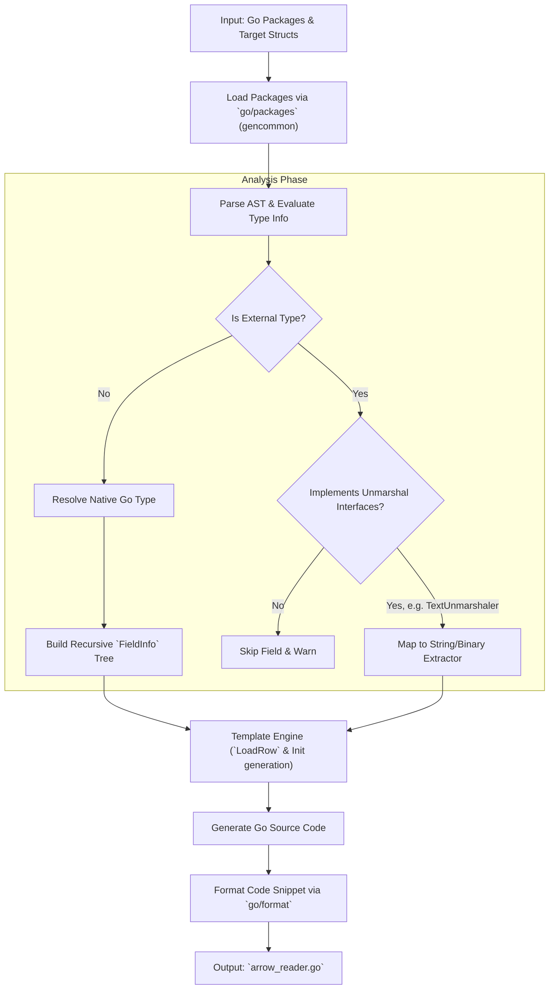

# Apache Arrow Reader Generator Manual

## Introduction

The Apache Arrow and Parquet ecosystems provide powerful columnar data
structures for peak performance in analytical workloads. However, when working
in Go, effectively reading complex, deeply nested Arrow records back into native
Go structs is just as challenging as writing them.

Traditionally, developers face two paths when reading columnar data:
1. **Manual Array Traversal**: Writing tedious, boilerplate-heavy code to
   extract values via `.Value(i)`, carefully checking `.IsNull(i)`, and managing
   complex offset math for lists (`ValueOffsets`) and maps. This is highly
   error-prone and brittle to schema evolution.
2. **Reflection-based Deserializers**: Using reflection (`interface{}`) to
   bridge Arrow arrays to Go struct fields. While easier to maintain, this
   drastically reduces read throughput and generates significant GC pressure
   through allocations, negating the zero-copy benefits of Arrow.

**`arrow-reader-gen`** is the reciprocal tool to `arrow-writer-gen`. It
statically introspects your Go types and generates highly optimized,
reflection-free, zero-allocation reader loops. It validates the Arrow schema
strictly at initialization time, returning an infallible, blazing-fast
`LoadRow(i, &out)` method that safely maps columnar data straight into your
domain structs.

## Features and Capabilities

The generator handles a vast array of Go idioms, translating from Arrow
constructs elegantly back to Native Go:

### Supported Data Types
* **Primitives**: `int8`, `int16`, `int32`, `int64`, `int` (widened), `uint8`,
  `byte`, `uint16`, `uint32`, `uint64`, `uint`, `float32`, `float64`, `bool`,
  `string`, `rune`.
* **Binary Data**: `[]byte` is natively special-cased to read from an Arrow
  `Binary` column.
* **Composites**: Native cross-package structs, pointers (nullable types),
  slices (`ListOf`), maps (`MapOf`), and fixed-size arrays (`FixedSizeList`).
* **Dictionary Encoding**: The reader transparently handles `*array.Dictionary`
  columns (common in Parquet imports), dynamically resolving indices to values
  without init-time materialization to preserve zero-copy benefits.

### Structures and Arbitrary Nesting
* **No Depth Limits**: Powered by the same recursive template architecture as
  the writer, complex properties like `[][][]int32` or
  `map[string]map[int64]Struct` are processed natively.
* **Zero-Allocation Reuse**: When populating slices, maps, or pointer-structs in
  `LoadRow(i, &out)`, the generated code deliberately reuses existing slice
  capacity, clears existing maps, and zeros pointed-to structs rather than
  allocating anew, dramatically minimizing GC overhead during batch reads.
* **Embedded Structs**: Arrow columns flattened by the writer are automatically
  reconstituted back into Go's embedded struct hierarchy.
* **Type Aliases**: Named composite types (e.g., `type Tags []string`) are
  correctly casted upon extraction.

### Edge Cases and Known Types
The generator seamlessly reverses standard library and Protobuf timestamp
mappings:
* `time.Duration`: Reads from Int64 (nanoseconds) back to `time.Duration`.
* `time.Time`: Reads from `Timestamp_ns` (UTC) back to `time.Time`.
* `durationpb.Duration`: Reads from Int64 back to `*durationpb.Duration`.
* `timestamppb.Timestamp`: Reads from `Timestamp_ns` back to
  `*timestamppb.Timestamp`.

### Interface Fallbacks and Error Accumulation
For types outside provided packages, it looks for standard unmarshalers:
1. `encoding.TextUnmarshaler`: Reads from `String` and populates via
   `UnmarshalText`.
2. `encoding.BinaryUnmarshaler`: Reads from `Binary` and populates via
   `UnmarshalBinary`.

**Note on Unmarshal Safety:** Since `LoadRow` is infallible but unmarshal
payload contents might be corrupt, generated readers transparently accumulate
slice-based `ReadError` entries (which trace the affected row, field path, and
underlying error) while leaving the target Go field at its zero value. You can
check these safely after processing a batch via `.Errors()`.

## Generator Workflow Architecture

Understanding how the reader connects AST parsing to array-extraction logic.



## Command Line Usage

The `arrow-reader-gen` CLI strictly mirrors the ergonomics of
`arrow-writer-gen`:

```bash
arrow-reader-gen [flags]
```

### Key Flags
* `--structs` / `-s` **(Required)**: Comma-separated list of top-level struct
  names to build readers for.
* `--pkg` / `-p` *(Repeatable, default `.`)*: Input packages to parse. Supply
  local directory paths or absolute Go module import paths.
* `--pkg-alias` / `-a` *(Repeatable)*: Avoid naming collisions by providing
  strict import path aliases (`importpath=alias`).
* `--pkg-name` / `-n`: Explicitly overwrite the `package` declaration produced
  in the generated `.go` output file.
* `--out` / `-o` *(Default `arrow-reader-gen.go`)*: Specific output file path.
* `--verbose` / `-v`: Emits comprehensive AST tracing, skipped item warnings,
  and type mappings.

### Example CLI Chains
**1. Single Package Parsing:**
```bash
arrow-reader-gen --pkg ./internal/model --structs User,Transaction --out custom_arrow_reader.go
```

**2. Cross-Package Parsing:** *(Structs originating from `types` will be
initialized and traversed properly!)*
```bash
arrow-reader-gen --pkg ./internal/model --pkg ./internal/types --structs OuterEvent --out reader.go
```

## Integration via `go:generate`

The most seamless way to construct your analytical ingest pipelines is by adding
a reciprocal directive next to the writer generator:

### Scaffolding Example

```go
package events

//go:generate go run go.resystems.io/eddt/cmd/arrow-writer-gen --pkg . --structs SystemEvent --out arrow_systemevent_writer_gen.go
//go:generate go run go.resystems.io/eddt/cmd/arrow-reader-gen --pkg . --structs SystemEvent --out arrow_systemevent_reader_gen.go

// SystemEvent captures a standardized infrastructure metric.
type SystemEvent struct {
    EventID     string           `json:"event_id"`
    Timestamp   time.Time        `json:"timestamp"`
    Component   string           `json:"component"`
    Metadata    map[string]string `json:"metadata"`
    Metrics     []MetricPoint    `json:"metrics"`
}

type MetricPoint struct {
    Name  string
    Value float64
}
```

Whenever you modify `SystemEvent` and run `go generate ./...`, both the
zero-copy writer and reader are instantly updated!

## Calling the Generated Reader

Once generated, the code yields a strict, infallible array-extraction API. Here
is a boilerplate pattern typically used when reading Parquet files or native
Arrow streams into Go:

```go
package events

import (
	"fmt"
	"log"

	"github.com/apache/arrow/go/v18/arrow"
)

func ReadEventRecord(record arrow.Record) {
	// Step 1: Instantiate the generated struct reader (Validation Phase)
	// This performs ALL strict schema checks, downcasting, and index resolution.
	reader, err := NewSystemEventArrowReader(record)
	if err != nil {
		log.Fatalf("Fatal schema mismatch: %v", err)
	}

	totalRows := int(record.NumRows())
	fmt.Printf("Reading %d events...\n", totalRows)

	// Step 2: Pre-allocate a single Go struct for zero-allocation reuse!
	var event SystemEvent

	// Step 3: Iterate through the batch
	for i := 0; i < totalRows; i++ {
		// LoadRow is infallible! It safely overrides `event` using existing slice/map capacity.
		reader.LoadRow(i, &event)

		fmt.Printf("Row %d: %s from %s with %d metrics\n",
			i, event.EventID, event.Component, len(event.Metrics))

		// Note: event struct pointers cannot be stashed/appended natively directly here
		// because of the targeted reuse. To store them, you must deep clone or perform work linearly.
	}

	// Step 4: Validate unmarshal logic accumulation (Optional, only if using external types)
	if errors := reader.Errors(); len(errors) > 0 {
		fmt.Printf("Encountered %d payload unmarshal errors decoding strings!\n", len(errors))
		// Optional: reader.ResetErrors()
	}
}
```

## Assumptions and Limitations

* `interface{}` / `any`: Rejected safely as Arrow requires strict schema
  definitions.
* **Schema Evolution / Missing Columns**: If the Arrow Record is missing a
  column that the Go struct defines, `NewXxxArrowReader` initialization
  gracefully succeeds, but the `LoadRow` bypasses that field, leaving it at its
  zero or previous initialized value.
* **Invalid Payload Errors**: The loader does not panic on `UnmarshalText` /
  `UnmarshalBinary` failures; it resets the field and buffers the error in
  `.Errors()`.
* **Zero Value Propagation**: To avoid dirty-read bugs resulting from object
  reuse across `LoadRow`, primitive Go columns corresponding to `null` Arrow
  entries correctly overwrite struct properties explicitly to their zero values
  (e.g., `""` or `0`).

## Summary

`arrow-reader-gen` effectively completes the Go analytical loop, enabling
unparalleled structural elegance when deserializing tabular memory
representation back into deep domain structures. By focusing on
validation-at-init and targeting zero-allocation properties, it easily achieves
throughput far exceeding traditional reflection.

Combined with `arrow-writer-gen`, these paired capabilities provide a complete
CQRS or data-engineering pipeline natively typed for the modern Go stack.
Submissions with improvements and enhancements are welcome.
