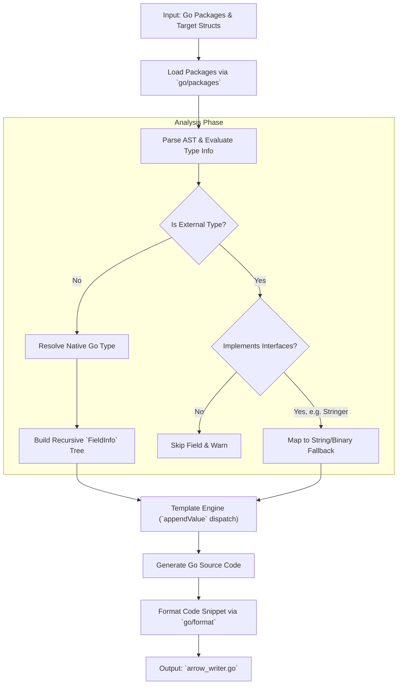

# Apache Arrow Writer Generator Manual

## Introduction

The Apache Arrow and Parquet ecosystems provide powerful columnar data
structures for peak performance in analytical workloads. However, when working
in Go with complex domain models, translating rich, deeply nested Go structs
into properly formatted Arrow structures is historically challenging. Developers
typically face two difficult choices:
1. **Manual Builder Construction**: Hand-coding nested `StructBuilder`,
   `ListBuilder`, and `MapBuilder` instances. This is a tedious, verbose, and
   highly error-prone process that is difficult to maintain as schemas evolve.
2. **Reflection-based Serializers**: Using reflection to infer structure at
   runtime. While convenient, this approach carries a significant performance
   penalty (CPU overhead and allocations), defeating the primary goal of using
   Arrow in the first place.

**`arrow-writer-gen`** solves this problem by providing a code generator that
statically introspects your Go types and outputs highly optimized,
reflection-free, and zero-copy append writers. It provides the ergonomics of
reflection with the blazing-fast performance of custom hand-written builders,
bridging the gap seamlessly between native Go structs and columnar analytical
formats.

## Features and Capabilities

The generator handles a vast array of Go idioms, translating them natively into
Apache Arrow constructs:

### Supported Data Types
* **Primitives**: `int8`, `int16`, `int32`, `int64`, `int` (widened to 64-bit),
  `uint8`, `byte`, `uint16`, `uint32`, `uint64`, `uint`, `float32`, `float64`,
  `bool`, `string`, `rune`.
* **Binary Data**: `[]byte` is natively special-cased to an Arrow `Binary`
  column (instead of `ListOf(Uint8)`).
* **Composites**: Native cross-package structs, pointers (nullable types),
  slices (`ListOf`), maps (`MapOf`), and fixed-size arrays (`FixedSizeList`).

### Structures and Arbitrary Nesting
* **No Depth Limits**: Powered by a recursive template architecture, the
  generator seamlessly handles arbitrary nesting depths. Complex properties like
  `[][][]int32`, `map[string][]int32`, or `map[string]map[int64]Struct` are
  processed natively without any depth restrictions.
* **Embedded Structs**: Promoted fields from embedded structs are flattened into
  the parent Arrow schema automatically.
* **Type Aliases**: Named slice, map, and array types (e.g., `type Tags
  []string` or `type MAC [6]byte`) are unwrapped to their underlying Arrow
  representation while preserving standard Go access semantics.

### Edge Cases and Known Types
The generator has out-of-the-box native mappings for specialized standard
library and Protobuf timestamp types:
* `time.Duration`: Mapped precisely to an Int64 column (nanoseconds) for
  lossless Parquet compatibility.
* `time.Time`: Mapped to a `Timestamp_ns` (UTC) column.
* `durationpb.Duration`: Processed safely with saturation arithmetic into an
  Int64 column (nanoseconds).
* `timestamppb.Timestamp`: Mapped to a `Timestamp_ns` (UTC) column.

### Interface Fallbacks for External Types
If a type originates from outside the provided input packages, the generator
elegantly falls back to standard interfaces in the following priority:
1. `encoding.TextMarshaler`: Mapped to a `String` column.
2. `fmt.Stringer`: Mapped to a `String` column.
3. `encoding.BinaryMarshaler`: Mapped to a `Binary` column.

## Generator Workflow Architecture

Understanding how the generator converts your Go AST into an Arrow schema helps
with debugging and structural planning.



## Command Line Usage

The `arrow-writer-gen` CLI is highly configurable, allowing multi-package
resolution gracefully:

```bash
arrow-writer-gen [flags]
```

### Key Flags
* `--structs` / `-s` **(Required)**: Comma-separated list of top-level struct
  names to build writers for. The generator will recursively discover and
  support any nested structures.
* `--pkg` / `-p` *(Repeatable, default `.`)*: Input packages to parse. You can
  supply local directory paths (e.g., `./internal/model`) or absolute Go module
  import paths (`github.com/user/repo/pkg`). Note: Import paths must exist in
  your `go.mod`.
* `--pkg-alias` / `-a` *(Repeatable)*: Avoid naming collisions by providing
  strict import path aliases (`importpath=alias`), e.g.,
  `go.example.com/api/v1/types=v1types`.
* `--pkg-name` / `-n`: Explicitly overwrite the `package` declaration produced
  in the generated `.go` output file.
* `--out` / `-o` *(Default `arrow-writer-gen.go`)*: Specific output file path.
* `--verbose` / `-v`: Emits comprehensive AST tracing, skipped item warnings,
  and type mappings.

### Example CLI Chains
**1. Single Package Parsing:**
```bash
arrow-writer-gen --pkg ./internal/model --structs User,Transaction --out custom_arrow_writer.go
```

**2. Cross-Package Parsing:** *(Structs coming from `types` will be parsed
natively into `StructBuilders`!)*
```bash
arrow-writer-gen --pkg ./internal/model --pkg ./internal/types --structs OuterEvent --out writer.go
```

## Integration via `go:generate`

The most seamless way to persist analytical models is by embedding
`arrow-writer-gen` into standard Go toolchains via `//go:generate`.

### Scaffolding Example
Place the directive in the same file as your domain struct. Note that we assume
your executable path or project path maps to `go.resystems.io/eddt`:

```go
package events

//go:generate go run go.resystems.io/eddt/cmd/arrow-writer-gen --pkg . --structs SystemEvent --out arrow_systemevent_gen.go

// SystemEvent captures a standardized infrastructure metric.
type SystemEvent struct {
    EventID     string           `json:"event_id"`
    Timestamp   time.Time        `json:"timestamp"`
    Component   string           `json:"component"`
    Metadata    map[string]string `json:"metadata"`
    Metrics     []MetricPoint    `json:"metrics"`
}

type MetricPoint struct {
    Name  string
    Value float64
}
```

Whenever you add fields to `SystemEvent` or `MetricPoint`, you simply run:
```bash
go generate ./...
```
Your zero-copy Arrow append logic is instantly updated.

### Calling the Generated Writer

Once the code is generated, your codebase will have a typesafe, reflection-free
builder ready to be used. Here is a boilerplate example demonstrating how to
invoke the API generated for the `SystemEvent` struct:

```go
package events

import (
	"fmt"

	"github.com/apache/arrow/go/v18/arrow/memory"
)

func BuildEventRecord() {
	// Initialize a tracked Arrow memory allocator
	pool := memory.NewCheckedAllocator(memory.NewGoAllocator())
	// In production, defer pool.AssertSize(t, 0) is often used in tests to ensure zero memory leaks

	// Step 1: Instantiate our generated struct writer
	writer := NewSystemEventArrowWriter(pool)
	defer writer.Release() // Release builder memory when done

	// Step 2: Append Domain structs directly bypassing reflection!
	e1 := SystemEvent{
		EventID:   "evt-100",
		Component: "database",
	}
	e2 := SystemEvent{
		EventID:   "evt-101",
		Component: "gateway",
	}

	writer.Append(&e1)
	writer.Append(&e2)

	// Step 3: Build the final Arrow Record for analytical downstreaming (e.g., Parquet export)
	record := writer.NewRecord()
	defer record.Release()

	fmt.Printf("Successfully built an Arrow record with %d rows!\n", record.NumRows())
}
```

## Assumptions and Limitations

To keep the generated constraints tight and type-safe, some edge cases are
intentionally unmapped:

* `interface{}` / `any`: Rejected safely. Arrow mandates strict, predictable
  static schemas which interfaces violate.
* `func()`, `chan`, `uintptr`: Cannot conceptually map to scalable columnar
  data, so they are silently skipped.
* **Unexported Fields**: If generating into a different target package
  (`--pkg-name`), unexported fields are intentionally omitted from external
  structs to avoid compiler errors.
* **Pointer Embedded Structs**: E.g., `type T struct { *Base }` are currently
  skipped with a warning, while value-embedded structs naturally flatten their
  promoted properties.

## Summary

`arrow-writer-gen` brings the power and structural elegance of Go models
straight into high-performance Apache Arrow memory representations. It removes
boilerplate, prevents reflection latency, and makes keeping analytical pipelines
aligned with domain models effortless.

We highly encourage you to utilize it as a standard step in your data
engineering or CQRS pipeline implementations. If you discover additional complex
structural corner cases or performance opportunities, patches and improvements
are always enthusiastically welcomed!
