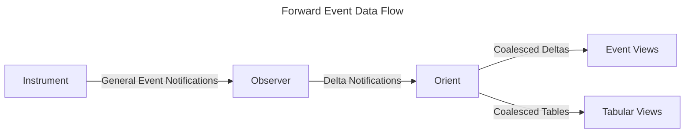

# Delta Flow

## Overview

The "delta flow" is a mechanism for propagating changes through the EDDT system.

The EDDT system is designed to manage relationships between data elements so as
to affect routing and therefore processing of data. The trigger to assert or
retract relationships can come from the processing of a wide range of event
notifications.

However, this utility of this processing ultimately relies on surfacing
well-defined eventually consistent information via either the direct event
notification streams, or via queries into tabular data.

Therefore, it is not sufficient to be able to route information, the information
also needs to be collated and coalesced into useful data units.

This aspect of the processing is primarily hidden in `F7` & `F10` which refers
to the functions of recording event notification information and then querying
and retrieving it respectively.

In this document, and the supporting pathfinder work we expand on and explore
the design details to practically support continual element changes and
information sharing within the system. That is, to embrace the concept of
information sharing through the flow and processing of differential changes, or
deltas.

## Goal

The intent of this pathfinder is specifically to provide a reference
implementation that covers the ingestion of event notifications and handles the
creation of deltas, together with the communication, storage and interpretation
of deltas in order to produce:
- information views that can be queried based on columnar semantics.
- information views that can be observed based on subject subscriptions.
- information elements that contain representative internal structure.

## Use-cases scenarios

The following scenarios should serve to highlight why relationship management is
not sufficient within a digital twin system. And that, we need to explicitly
design for delta aggregation.

### Urban Micromobility

Let's consider the case of building a real-time digital twin of an urban
mobility service. In its simplest form, the basic units are the scooters. The
event-driven digital twin must continuously process updates received from
scooters in order to maintain a continuous view of the state of all the scooters
in the fleet e.g. lon/lat, battery-level, serial-number, ride-status, speed etc.

However, we can can easily see that the system model can be usefully extended to
include the following elements:
- __scooter__ - the frame and motor assembly that carries the rider (and
  battery).
- __battery__ - the removable battery unit used to power the scooter.
- __rider__ - the person using an app to reserve a scooter and then ride the
  scooter.
- __parking-area__ - locations where scooters can be parked.
- __charging-dock__ - contains multiple slots for batteries to be charged.
- __service-vehicle__ - used to redistribute scooters and balance the system.
- __juicer__ - the operator driving the service-vehicle.
- __zone__ - geospatial zones used to manage regulatory requirements or rider
  behaviour.

We can immediately see that, there are tangible relationships between the
elements that need to be tracked and maintained. But, we can similarly see that
the individual elements are undergoing continuous state flux.

It is this flux in state that we need to support in our digital twin. The design
below will focus on managing this be treating the deltas as the basic building
blocks of information state. Importantly, we do then still need to manage the
relationships between elements that may be implied by, or inferred from the
element state. However, relationship tracking may be done separately (and in a
later feedback loop if if necessary).

#### Scooter Life-Cycle

While each of the elements in the urban mobility model has its own life-cycle,
we will start by focusing on the scooter itself.

##### 1. Capacity Planning (The Demand Signal)

Before the asset exists, it is established as a requirement. This phase
involves analysing utilisation heatmaps to decide "We need 500 more units in
Paris."

  - Physical Action: Procurement orders are placed with the manufacturer.
  - Digital Twin State: `Planned` to indicated staged future inventory.
  - The Trigger: `DemandForecastEvent` (Aggregate data, not per-scooter).
    - Placeholder: UUIDs are generated for the future asset.

##### 2. Provisioning (The Digital Birth)

The asset is created in the back-end system before it arrives. This establishes
its identity and security credentials.

  - Physical Action: Allocate MAC addresses, and PKI certificates, SIM
    profiles.
  - Digital Twin State: `Provisioned` indicating ordered inventory.
  - The Trigger: `AssetCreatedEvent`
	- Payload: Static Reference Data (Serial Number, Hardware Revision,
	  Manufacturer ID).
	- Context: The "Ghost" twin exists but has no telemetry.

##### 3. Commissioning (The Physical Birth)

The asset arrives, is unboxed, turned on, and verifies its connection to the
network.

  - Physical Action: Technician powers on the scooter; field test performed
    (brakes, lights, GPS lock).
  - Digital Twin State: `Active` indicating that the scooter is online.
  - The Trigger: `CommissioningEvent` (or `EnrollmentEvent`).
	- Payload: Initial telemetry (GPS Lat/Long, Battery 100%, Firmware Version).
	- Logic: The system validates the Provisioned credentials and flips the
	  state to Active.

##### 4. Operation (The Active Life)

This is the Utilisation Stage. It is the longest phase where the vast majority
of your "Delta Flows" occur.

  - Physical Action: Rides, parking, charging, weather exposure.
  - Digital Twin State: Fluctuates between Available, In-Trip, Reserved,
    LowBattery, Maintenance.
  - The Trigger: Continuous stream of `LocationChanged`, `StatusChanged`,
    `BatteryLevelChanged` or similar.
  - The Ride Loop (Sub-cycle):
	- Event: `ReservationRequest` notification indicating the need for a free
	  scooter, along with `UnlockEvent` or `ParkEvent`.
    - State: `Available` → `Reserved` → `In-Trip` → `Returned` → `Available`
    - Action: Wait for rider rider input to move between system states.
  - The Maintenance Loop (Sub-cycle):
	- Event: `FaultDetected` notifiaction (e.g., "Brake Sensor Failure").
	- State: `Maintenance` (Unavailable to users).
	- Action: Repair.
	- Return: `RecommissioningEvent` (sets state back to Available).

##### 5. Decommissioning (The Withdrawal)

The asset is formally taken out of service due to age, irreparable damage, or
theft. It is the "End of Life" decision.

  - Physical Action: The scooter is collected by a van and brought to a depot
    for the final time.
  - Digital Twin State: `Decommissioned` / `Retired`.
  - The Trigger: `DecommissionEvent`.
	- Payload: Reason Code (e.g., "Battery End-of-Life", "Vandalism").
	- Logic: The system stops accepting new telemetry deltas from this ID to
	  prevent "zombie" data.

##### 6. Disposal (The Physical End)

The physical hardware is processed. This is distinct from decommissioning
because it involves third parties (recyclers).

  - Physical Action: Battery removed for hazardous waste processing; chassis
    shredded or sold for scrap; usable parts cannibalised.
  - Digital Twin State: `Disposed`.
  - The Trigger: `AssetDisposalEvent`.
	- Payload: Certificate of Destruction ID, Recycling Partner ID.
	- Importance: Critical for ESG (Environmental, Social and Governance)
	  reporting (proving 98% recyclability).

##### 7. Deprovisioning (The Digital Death)

This is the security cleanup. It ensures the digital identity can never be used
again.

  - Physical Action: Revoking the SIM card; putting the UUID on a "Blacklist" or
    "Burned" list; revoking security certificates.
  - Digital Twin State: `Archived`.
  - The Trigger: `DeprovisioningEvent`.
	- Logic: The entity row is effectively "tombstoned" permanently or moved to
	  a cold-storage "History" table. The primary system no longer holds this
      asset in memory.

#### Scooter State

While the overall life-cycle is key to understanding what the scooter is
service currently providing, and what can be done with it next, we still want to
keep track of operational details of the scooter.

A simple list might include:
- `Activity-State` the current life-cycle activity state of the scooter.
- `Speedometer-Speed` the instantaneous speed measured by the scooter.
- `Pitch` the angle of the scooter body measured nose-to-tail.
- `Roll` the angle of the scooter body measured side-to-side.
- `Steering-Angle` the angle of the steering column relative to the neutral
  position.
- `Lon-Lat` the current geographic coordinates of the scooter.
- `Motor-Speed` the current RPM of the motor.
- `Motor-Temperature` the current operating temperature of the motor.
- `Assigned-Rider` the currently assigned rider.
- `Connected-Battery` the identifier for the battery currently powering the
  scooter.

## Requirements

### Checkist

- [ ] separation between delta flows and domain specific event notification
  flows
- [ ] partial deltas that only contain state changes for some fields
- [ ] data encoding at source that includes the origin, timestamps and TTL
- [ ] deltas and notification representations encoded via Avro
- [ ] deltas include assert versus retract indicators at the element level
- [ ] deltas include update instructions per field
- [ ] streaming of changes into Parquet partitions while retaining delta
  semantics
- [ ] base state represented as degenerate delta that includes only "set value"
  instructions
- [ ] windowing queries that together with case statements to facilitate roll-up
- [ ] pipeline spanning ingestion, transport,
- [ ] nested type handling.
  - [ ] handle struct and list "shredding" (unrolling)
  - [ ] handle union unrolling using dense unions (rather than spare unions)

## Design

The delta flow is based on the notion of delta events, which are events that
represent changes to the digital twin.

### Definitions

- __event__ - any system state change that can be observed (physical or
  ).
- __event notification__ - a representation that encodes the information that
  describes the event.
- __trigger__ - an event that initiates some further action.
- __action__ - a process that is performed as a result of detecting a triggering
  .
- __element__ - any part of the system (physical or informational).
- __fact__ - an information element (or aspect of some information element) that
  knowledge in the system.
- __assertion__ - the addition of a fact to the system state.
- __retraction__ - the removal of a fact from the system state.
- __delta__ - a specialised event notification that signals the information changes
  be applied to an information element.
- __data flow__ - a general flow consisting of transportation, routing and
  of event notifications.
- __delta flow__ - a specialised data flow that consists of a continual flow of
  that is supported by coalescence logic and information persistence.
- __relationship__ - a asserted information link between two elements.

### Data Flow

Note, in the above definitions we have generalised event notifications as well
as delta event notifications. As a key architectural choice, we decouple
generalised instrumentation events from the digital twin differential change
events. Additionally, in more complex processing scenarios we would expect to
see enrichment processing and data transformation events that are again separate
from the delta flow events.

Below is a subset summary of the forward event flow in the system, focusing on
the collation of information.

(We are ignoring the full processing flow suggested by the OODA loop, so the
view does not include provision for the decision logic or control plane
governors. Additionally, we do not unpack the richness implied by the analysis
and synthesis required for the orientation process.)

We can see that the delta flow is a subset of the general event flow.
Additionally, the _Observer_ process step is responsible for collecting
sufficient state in order to produce delta commands for specific elements within
the digital twin representation. Whereas, the _Orient_ process step is
responsible for collecting and coallating the deltas into a coherent state.

#### Medallion Architecture

Note, the above aligns with the so-called medallion architecture:
- __Bronze:__ raw data
  - (general event notifications; instruments and observe)
    - (output: delta notifications)
- __Silver:__ cleaned, enriched and conformed data
  - (delta notifications; orient)
    - (output: coalesced deltas)
- __Gold:__ aggregated, business-ready data
  - (coalesced deltas; orient and views)
    - (output: coalesced tables and views)

### Delta Commands

In order to implement our delta flow we will define delta commands generally.

Each delta command is a recursive structure that represents a change to an
information element. The information element can be:
- asserted - here we provide the actual value to set.
- retracted - here we indicate that the element should be removed.
- ignored - here we indicate that the delta does not include useful information
  for the element.
- reset - here we indicate that the element should be reset to its default
  value.

Therefore, we define a local delta as the union over:
- value
- operation { retract, ignore, reset }

In the case that the element's value type is a primitive type, the value is used
as-is. In the case that the element's value type is a complex type (list or
struct), we have the choice of defining that type in terms of deltas or in terms
of a raw values. This is a design choice that is made on a per-element basis.

The delta notifications start life as Avro messages. These are then aggregated
into Avro OCF files. Finally, the OCF files are published to Parquet, via
duckdb.

Ultimately, the complex types will be "shredded" at the point that they are
published to Parquet. Interpretation by duckdb is then dependent on the Parquet
schemas.

## Evaluation

We have different data flows through the system that need to be evaluated:
- event flows via NATS covering transport and routing
- delta information flows covering inception, storage, querying, notification

The second flow is of crucial importance to this pathfinder. Essentially we need
to answer the questions:

> Can we represent notifications in Avro that will be naturally transformed and
> appended to Parquet partitions, such that these partitions can be queried via
> duckdb? Once queries, can we represent elements via Avro again? And then,
> crucially, will each of these steps correctly handle nested data types holding
> lists, structs and unions?

Once we have answered the above questions in terms of verifying the existence of
a working solution and its correctness, we then need to additionally answer
performance questions:

> How many event notifications can be processed per second in order to build
> deltas? How many deltas can be batched and recorded per second as parquet? How
> many base deltas and overlay deltas can be queried per second to form result?

## Findings

### Unions

A critical issue is that whie Arrow and Avro both natively support _union_
types, and the unions should convert cleanly to Parquet for use via DuckDB or
other tools, it seems that this conversion is quite fiddly. The handling is
different and confusing.

Ultimately, the items are being rolled into a columnar representation.
Additionally, the use of the union is between an op-code and a value.

Therefore, the actuall value of the union type is questionable.

Instead, we will consider using an explicit tuple:
- `(op-code, value)` where the value is nullable.

## See Also

- duckdb
- Arrow
- Avro
- Parquet
- Columnar DB
- golang
- NATS

## References
