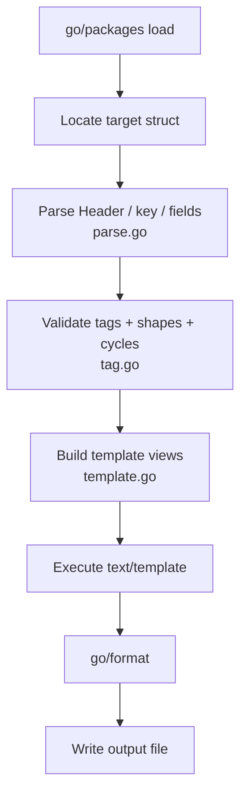

<!-- markdown-pdf:
watermark:
  text: null
-->
# delta-gen — Code Generator Manual

<!-- TOC generated by scripts/markdown-toc.py -->

- [Introduction](#introduction)
- [Quick Start](#quick-start)
- [Authoring Contract](#authoring-contract)
  - [Header Embedding](#header-embedding)
  - [Entity-Key Field](#entity-key-field)
  - [Payload Fields](#payload-fields)
- [Tag Reference](#tag-reference)
  - [Combining Tags](#combining-tags)
  - [Tag Options](#tag-options)
- [Generator Workflow Architecture](#generator-workflow-architecture)
- [Command Line Usage](#command-line-usage)
  - [Key Flags](#key-flags)
  - [Example CLI Chains](#example-cli-chains)
  - [Integration via `//go:generate`](#integration-via-gogenerate)
- [Generated API](#generated-api)
  - [Types Emitted](#types-emitted)
  - [Package-Level Functions](#package-level-functions)
  - [Same-Package Method Wrappers](#same-package-method-wrappers)
  - [Calling Pattern](#calling-pattern)
  - [Direct Delta Construction](#direct-delta-construction)
- [Cross-Package Mode](#cross-package-mode)
  - [Behaviour Differences](#behaviour-differences)
  - [Key Flags for Cross-Package Mode](#key-flags-for-cross-package-mode)
  - [Example Invocations](#example-invocations)
  - [Import Alias Resolution](#import-alias-resolution)
- [Behavioural Invariants](#behavioural-invariants)
- [Assumptions and Limitations](#assumptions-and-limitations)
- [Summary](#summary)

<!-- /TOC -->

## Introduction

Event-Driven Digital Twin (EDDT) Snapshots carry rich domain state that must
flow through a chain-lifecycle protocol: each state change produces a minimal
*delta*, deltas can be applied to advance a snapshot forward, and sequences of
deltas can be coalesced without losing information. Every Snapshot type also
needs a deterministic, content-hashed identity so that events from independent
producers converge on the same entity key.

Hand-writing `Apply`, `Diff`, `Coalesce`, and `EntityID` for every Snapshot
type is error-prone, violates DRY, and makes it easy to introduce subtle
divergences between types. **`delta-gen`** eliminates that burden.

`delta-gen` reads a Go struct annotated with `eddt:"…"` struct tags, validates
the authoring contract, and emits the companion `Delta` type together with all
four operations as a single, gofmt-clean Go source file. The generator is
invoked at build time via `//go:generate` and, like `arrow-writer-gen` and
`arrow-reader-gen`, requires no runtime reflection — the output is plain,
type-safe Go code that the compiler optimises in the usual way.

## Quick Start

Define your Snapshot struct. `delta-gen` needs exactly one embedded
`runtime.Header`, exactly one entity-key field, and any number of payload
fields annotated with optional `eddt:"…"` tags:

```go {: .small-text }
package pump

import (
    "time"
    eddt "go.resystems.io/eddt/runtime"
)

// SiteAddress is the physical installation address of a pump.
type SiteAddress struct {
    Street string
    City   string
}

// CalibrationData holds factory calibration state for a pump.
type CalibrationData struct {
    OffsetKPa   float32
    LastCalibAt time.Time
}

//go:generate delta-gen PumpSnapshot

// PumpSnapshot is an EDDT Snapshot for a manufacturing line pump.
type PumpSnapshot struct {
    eddt.Header
    SerialNumber string          `eddt:"entity.key"`
    PressureKPa  float32
    TempCelsius  float32
    Location     SiteAddress     `eddt:"delta.nested"`
    Calibration  CalibrationData `eddt:"delta.nested,delta.clearable"`
    FirmwareVer  string          `eddt:"delta.omit"`
}
```

Run the generator:

```bash {: .small-text }
go generate ./...
```

`delta-gen` writes `pump_snapshot_delta.go` into the same directory (the
output filename is auto-derived from the struct name: `PumpSnapshot` →
`pump_snapshot_delta.go`). The generated file contains:

- `SiteAddressDelta`, `CalibrationDataDelta` — companion Delta types for nested fields.
- `PumpSnapshotDelta` — the root companion Delta struct.
- `Apply`, `Diff`, `Coalesce` — package-level functions and method wrappers.
- `EntityID(k string)` — package-level function (no method wrapper for plain `string` keys).

Minimal calling pattern:

```go {: .small-text }
// Compute the delta between two snapshots.
d, err := pump.Diff(before, after)
if err != nil {
    return err
}

// Apply the delta to advance the snapshot.
next, err := pump.Apply(before, d)
if err != nil {
    return err
}

// Or, using the method wrapper:
next, err = before.Apply(d)
```

## Authoring Contract

### Header Embedding

Every Snapshot struct must embed exactly one `runtime.Header` field. The
generator identifies the Header by *type identity*, not by field name, so
import aliases are fully supported:

```go {: .small-text }
import eddt "go.resystems.io/eddt/runtime"

type PumpSnapshot struct {
    eddt.Header           // alias "eddt" — recognised correctly
    SerialNumber string `eddt:"entity.key"`
    // ...
}
```

Embedding zero or more than one `runtime.Header` is rejected with a diagnostic
naming the offending struct.

### Entity-Key Field

Exactly one field must be designated as the entity key, either via the
`eddt:"entity.key"` tag or via the `--key-field` CLI flag (see §6).

The key field must be *value-typed* and *comparable*:

- **Scalars** (`bool`, `int32`, `string`, named basic types) — always comparable.
- **Named struct types** — comparable when all sub-fields are comparable (no
  slices, maps, channels, or non-comparable interfaces).
- **Pointer fields** are rejected: two pointers to equal values are not equal
  as pointers.

The generator hashes the key struct's fields in lexicographic field-name order
to compute the `runtime.EntityID` that goes into `runtime.Header.EntityID`.

### Payload Fields

Every field that is not the embedded Header or the entity key is a *payload
field*. Payload fields are included in the companion Delta unless tagged
otherwise (see §4).

Admitted shapes:

| Shape        | Go syntax            | Default Delta representation | With `delta.nested`    |
|:-------------|:---------------------|:-----------------------------|:-----------------------|
| Scalar       | `T` (basic or named) | `Set<F> *T`                  | *(not admitted)*       |
| Pointer      | `*T`                 | `Set<F> **T`                 | *(not admitted)*       |
| Struct value | `NamedStruct`        | `Set<F> *NamedStruct`        | `<F> NamedStructDelta` |
| Slice        | `[]T`                | `Set<F> *[]T`                | `<F> <F>Delta`         |
| Map          | `map[K]V`            | `Set<F> *map[K]V`            | `<F> <F>Delta`         |

For `delta.nested` fields the Delta entry is a companion type embedded by value
(not a pointer), so a zero-valued entry means "no change" without any allocation.
Adding `delta.clearable` to a `delta.nested` field wraps the companion in a
`runtime.FieldDelta[NamedStructDelta]` tri-state envelope (see §4).

Rejected shapes: function, channel, interface, and anonymous struct types are
rejected with a diagnostic.

In cross-package mode (§7), unexported fields are silently dropped because they
are inaccessible from the generated output package.

## Tag Reference

All tags are written in the `eddt:"…"` struct field tag. Multiple values are
comma-separated. Unknown option keys within a tag value are preserved without
error.

| Tag                 | Axis        | Admitted Shapes          | Notes                                   |
|:--------------------|:------------|:-------------------------|:----------------------------------------|
| `entity.key`        | Identity    | scalar, named struct     | Exactly one required; drives EntityID   |
| `delta.nested`      | Granularity | named struct, slice, map | Emits companion `<T>Delta` type         |
| `delta.clearable`   | Envelope    | *(secondary modifier)*   | Tri-state; requires `delta.nested`      |
| `delta.omit`        | Presence    | any                      | No Delta field; Apply carries unchanged |
| `delta.retired`     | Presence    | any                      | Like omit; accepts `since=<date>`       |
| `delta.commutative` | Presence    | any *(reserved)*         | No-op in v1; accepted without effect    |

### Combining Tags

Tags operate on three independent axes. The most common combination is
`delta.nested,delta.clearable`, which changes the Delta field from a
simple `*<T>Delta` pointer (assert-or-no-op) into a
`runtime.FieldDelta[<T>Delta]` tri-state carrier:

```go {: .small-text }
type PumpSnapshot struct {
    eddt.Header
    SerialNumber string          `eddt:"entity.key"`
    Location     SiteAddress     `eddt:"delta.nested"`                 // → Location SiteAddressDelta
    Calibration  CalibrationData `eddt:"delta.nested,delta.clearable"` // → Calibration FieldDelta[CalibrationDataDelta]
    // ...
}
```

`delta.clearable` is a *secondary modifier* — it never appears alone; it sets
a flag alongside whichever primary tag (`delta.nested`) occupies the field's
kind. A `delta.clearable` without `delta.nested` is rejected with a diagnostic.

### Tag Options

- `delta.retired,since=2026-05-20` — the `since` option records the retirement
  date and is preserved in the raw tag string. Unknown options (e.g.
  `delta.commutative,mode=last-write-wins`) are accepted without action.

## Generator Workflow Architecture



The pipeline has four stages, each implemented in its own file:

- **Load** (`load.go`) — resolves `--pkg` arguments into fully type-checked
  `*packages.Package` values using `golang.org/x/tools/go/packages`. Filesystem
  paths and Go import paths are handled separately so that each path can belong
  to its own Go module.
- **Parse** (`parse.go`) — locates the target struct, identifies the embedded
  `runtime.Header` by type identity, discovers the entity-key field, and
  classifies each payload field's shape.
- **Tag** (`tag.go`) — parses `eddt:"…"` values into structured `ParsedTag`
  objects and validates tag-combination and shape constraints.
- **Emit** (`template.go`, `generator.go`) — builds typed view structs from the
  parse results and renders them through a `text/template` pipeline, producing
  gofmt-clean Go source.

## Command Line Usage

### Key Flags

| Flag          | Short | Type          | Default | Purpose                                              |
|:--------------|:------|:--------------|:--------|:-----------------------------------------------------|
| `--pkg`       | `-p`  | string (rep.) | `.`     | Input package: filesystem path or Go import path     |
| `--type`      | `-t`  | string (rep.) | —       | Snapshot struct name(s); may also be positional args |
| `--out`       | `-o`  | string        | —       | Output file; omit for per-struct auto-derived names  |
| `--pkg-name`  | `-n`  | string        | —       | Output package name (activates cross-package mode)   |
| `--pkg-alias` | `-a`  | string (rep.) | —       | `importpath=alias` for name collisions               |
| `--key-field` | —     | string (rep.) | —       | `[StructName=]FieldName` entity-key override         |
| `--verbose`   | `-v`  | bool          | false   | Info-level logging to stderr                         |

`--pkg` and `--type` (and `--key-field`, `--pkg-alias`) are repeatable and
also accept comma-separated lists. At least one struct name is required, either
as a positional argument or via `--type`.

### Example CLI Chains

```bash {: .small-text }
# Single struct — output auto-derived as pump_snapshot_delta.go
delta-gen PumpSnapshot

# Multiple structs in the current package — one file per struct
delta-gen PumpSnapshot ValveSnapshot

# Multiple structs bundled into one explicit output file
delta-gen PumpSnapshot ValveSnapshot --out equipment_delta.go

# Explicit package path
delta-gen --pkg ./internal/model PumpSnapshot

# Go import path (must be in go.mod; run 'go get <path>' if needed)
delta-gen --pkg go.example.com/plant/model --type PumpSnapshot

# Cross-package: generate into package "deltas" from package "model"
delta-gen --pkg ./internal/model --pkg-name deltas PumpSnapshot

# Cross-package with alias to resolve import collision
delta-gen --pkg ./internal/model --pkg-name deltas \
          --pkg-alias go.example.com/plant/model=plantmodel PumpSnapshot

# Key-field override for a Snapshot whose key type cannot be annotated
delta-gen --key-field PumpSnapshot=SerialNo PumpSnapshot
```

### Integration via `//go:generate`

Place the directive in the same package as the Snapshot struct:

```go {: .small-text }
// Single struct — output auto-derived
//go:generate delta-gen PumpSnapshot

// Multiple structs in the same package — one file per struct
//go:generate delta-gen PumpSnapshot ValveSnapshot

// Cross-package: Delta types land in a separate "deltas" package
//go:generate delta-gen --pkg . --pkg-name deltas --out ../deltas/pump_snapshot_delta.go PumpSnapshot
```

Run with:

```bash {: .small-text }
go generate ./...
```

## Generated API

Using the `PumpSnapshot` example from §2, the generator emits the following
types and functions.

### Types Emitted

The following is taken directly from the generated `pump_snapshot_delta.go` for
the `PumpSnapshot` defined in §2 (elided for brevity):

```go {: .small-text }
// SiteAddressDelta is the Delta companion for the delta.nested Location field.
type SiteAddressDelta struct {
    SetStreet *string
    SetCity   *string
}

// CalibrationDataDelta is the Delta companion for the delta.nested+clearable Calibration field.
type CalibrationDataDelta struct {
    SetOffsetKPa   *float32
    SetLastCalibAt *time.Time
}

// PumpSnapshotDelta is the root companion Delta for PumpSnapshot.
// FirmwareVer is absent (delta.omit). Location is an embedded value — a
// zero-valued SiteAddressDelta means "no change". Calibration is a
// FieldDelta tri-state envelope.
type PumpSnapshotDelta struct {
    runtime.Header
    SetPressureKPa *float32
    SetTempCelsius *float32
    Location       SiteAddressDelta
    Calibration    runtime.FieldDelta[CalibrationDataDelta]
}
```

Note that `Location` (a plain `delta.nested` field) is embedded by value, not
as a pointer. A zero-valued `SiteAddressDelta` is a no-op when applied. Only
`delta.nested,delta.clearable` fields use the `runtime.FieldDelta[T]` envelope.

### Package-Level Functions

```go {: .small-text }
// Apply produces the Snapshot that results from applying d to s.
func Apply(s PumpSnapshot, d PumpSnapshotDelta) (PumpSnapshot, error)

// Diff produces the minimal delta such that Apply(a, d) payload-equals b.
func Diff(a, b PumpSnapshot) (PumpSnapshotDelta, error)

// Coalesce applies a slice of deltas to s in order, returning the final Snapshot.
func Coalesce(s PumpSnapshot, ds []PumpSnapshotDelta) (PumpSnapshot, error)

// EntityID derives the deterministic content-hash of the entity key value.
// Takes the key value directly, not a Snapshot pointer.
func EntityID(k string) runtime.EntityID
```

All functions take and return values, not pointers. The `Coalesce` function
folds a *slice* of deltas onto a base snapshot — it is not a two-delta merge.

### Same-Package Method Wrappers

When the output package matches the source package, method wrappers are emitted:

```go {: .small-text }
func (s PumpSnapshot) Apply(d PumpSnapshotDelta) (PumpSnapshot, error)
func (a PumpSnapshot) Diff(b PumpSnapshot) (PumpSnapshotDelta, error)
func (s PumpSnapshot) Coalesce(ds []PumpSnapshotDelta) (PumpSnapshot, error)
```

The `EntityID` method wrapper is only emitted when the entity-key type is a
*named* Go type (e.g. `type SerialNumber string`). For a plain `string` key,
only the package-level `EntityID(k string)` function is generated.

Method wrappers are **not** emitted in cross-package mode (see §7).

### Calling Pattern

```go {: .small-text }
// --- Snapshot authoring ---

sn := "SN-4719"
a := pump.PumpSnapshot{
    Header: runtime.Header{
        EntityID:    pump.EntityID(sn),
        ChainID:     "chain-SN-4719",
        Sequence:    0,
        EffectiveAt: t0,
        PublishedAt: t0,
    },
    SerialNumber: sn,
    PressureKPa:  850.0,
    TempCelsius:  72.3,
    Location:     pump.SiteAddress{Street: "Mill Road 1", City: "Berlin"},
}

// --- Producing a delta via Diff ---

b := a
b.Header.Sequence = 1
b.PressureKPa = 855.5

d, err := pump.Diff(a, b) // or: a.Diff(b)
if err != nil {
    return err
}

// --- Applying a delta ---

next, err := pump.Apply(a, d) // or: a.Apply(d)
if err != nil {
    return err
}
// Round-trip: next.PressureKPa == b.PressureKPa

// --- Coalescing a sequence of deltas ---

result, err := pump.Coalesce(a, []pump.PumpSnapshotDelta{d1, d2, d3})
```

### Direct Delta Construction

A `TDelta` is a plain Go struct and can be constructed directly. This is
preferable when the change source already knows exactly which fields changed
(e.g. an incoming sensor reading) and diffing two full snapshots would be
wasteful.

For atomic fields (`SetPressureKPa`, `SetTempCelsius`) a nil pointer means
*no change*. For `delta.nested` fields (`Location`) the companion struct is an
embedded value — a zero-valued `SiteAddressDelta` is also a no-op. For
`delta.clearable` fields (`Calibration`) set the `Op` explicitly.

```go {: .small-text }
// ptr is a generic helper for building pointer literals.
func ptr[T any](v T) *T { return &v }

// advance builds the Header for the next delta in the chain, copying
// EntityID and ChainID from the prior snapshot and incrementing Sequence.
advance := func(prior pump.PumpSnapshot) runtime.Header {
    return runtime.Header{
        EntityID:    prior.Header.EntityID,
        ChainID:     prior.Header.ChainID,
        Sequence:    prior.Header.Sequence + 1,
        EffectiveAt: now,
        PublishedAt: now,
        Provenance:  append(prior.Header.Provenance, runtime.Provenance{
            PublishedAt: now,
            Solution:    "plant-control",
            Component:   "pressure-monitor",
        }),
    }
}

// --- Step 1: update one atomic field ---

d1 := pump.PumpSnapshotDelta{
    Header:         advance(current),
    SetPressureKPa: ptr(float32(855.5)),
    // SetTempCelsius: nil  — temperature unchanged
    // Location:       zero — no location change (zero SiteAddressDelta is a no-op)
    // Calibration:    zero — no calibration change (OpIgnore is the zero value)
}
step1, err := pump.Apply(current, d1)

// --- Step 2: update the delta.nested Location field ---
//
// Location is a SiteAddressDelta value embedded directly in PumpSnapshotDelta.
// Only set the sub-fields that should change; nil sub-fields are left unchanged.

d2 := pump.PumpSnapshotDelta{
    Header:   advance(step1),
    Location: pump.SiteAddressDelta{SetCity: ptr("Hamburg")},
}
step2, err := pump.Apply(step1, d2)

// --- Step 3: assert a new Calibration value (OpAssert) ---
//
// OpAssert applies the inner CalibrationDataDelta to the existing value.

d3 := pump.PumpSnapshotDelta{
    Header: advance(step2),
    Calibration: runtime.FieldDelta[pump.CalibrationDataDelta]{
        Op:    runtime.OpAssert,
        Value: pump.CalibrationDataDelta{SetOffsetKPa: ptr(float32(-0.3))},
    },
}
step3, err := pump.Apply(step2, d3)

// --- Step 4: retract the Calibration field (OpRetract) ---
//
// OpRetract resets Calibration to its zero value.

d4 := pump.PumpSnapshotDelta{
    Header:      advance(step3),
    Calibration: runtime.FieldDelta[pump.CalibrationDataDelta]{Op: runtime.OpRetract},
}
step4, err := pump.Apply(step3, d4)
// step4.Calibration == CalibrationData{} (zero value)

// A zero-valued FieldDelta (Op == OpIgnore) leaves the field unchanged —
// omit the Calibration assignment entirely when constructing a delta that
// does not touch it.
_ = step4
```

## Cross-Package Mode

Cross-package mode activates when `--pkg-name` specifies a package name that
differs from the source package. The generated file belongs to the output
package and qualifies all source-package type references with the source package
name.

### Behaviour Differences

Compared to same-package mode, cross-package mode:

- **Omits method wrappers** — `Apply`, `Diff`, `Coalesce`, and `EntityID` are
  package-level functions only. Go forbids defining methods on types from
  another package.
- **Silently drops unexported fields** — fields not accessible outside the
  source package cannot appear in the generated code.
- **Qualifies type references** — a field of type `CalibrationData` becomes
  `model.CalibrationData` in the generated Delta struct when the source package
  is `model`.

### Key Flags for Cross-Package Mode

- `--pkg-name` / `-n` — the output package name. Setting this to anything other
  than the source package name activates cross-package mode.
- `--pkg-alias` / `-a` — resolves import-path collisions when two packages
  would share the same local identifier. Format: `importpath=alias` (e.g.
  `go.example.com/plant/model=plantmodel`).

### Example Invocations

```bash {: .small-text }
# Baseline: same-package mode (method wrappers emitted)
delta-gen PumpSnapshot

# Cross-package: Delta types in package "deltas", source in package "model"
delta-gen --pkg ./internal/model --pkg-name deltas \
          --out ./internal/deltas/pump_snapshot_delta.go \
          PumpSnapshot

# Cross-package with alias — two packages that would both import as "model"
delta-gen --pkg ./internal/pump/model \
          --pkg ./internal/site/model \
          --pkg-name deltas \
          --pkg-alias go.example.com/plant/pump/model=pumpmodel \
          --pkg-alias go.example.com/plant/site/model=sitemodel \
          PumpSnapshot SiteSnapshot
```

### Import Alias Resolution

When generating the import block, the generator uses `--pkg-alias` entries
to replace default local names. Without an alias, a package at
`go.example.com/plant/model` is imported as `model`. With
`--pkg-alias go.example.com/plant/model=plantmodel`, every reference in the
generated code uses the alias `plantmodel` and the import is written as
`plantmodel "go.example.com/plant/model"`.

## Behavioural Invariants

The generated `Apply`, `Diff`, `Coalesce`, and `EntityID` functions satisfy
three algebraic laws that downstream consumers can rely on:

1. **Round-trip** — given chain-integrity preconditions, `Apply(a, Diff(a, b))`
   equals `b` in the payload component. A `Diff` encodes the change faithfully
   and `Apply` reproduces it exactly.

2. **Identity-diff** — `Diff(a, a)` produces a Delta whose every payload
   representation is zero-valued. No spurious field updates are emitted for
   equal snapshots.

3. **Nil/empty equivalence** — slice and map fields treat `nil` and an empty
   collection (`[]T{}`, `map[K]V{}`) as identical. Initialisation artefacts
   do not produce spurious `Added` or `Removed` entries.

Full formal statements of these invariants — together with the clearable
truth-table, set-membership semantics, provenance accumulation, chain-integrity
enforcement, and purity requirements — are in
[delta-gen-spec.md](delta-gen-spec.md) §5.3.

## Assumptions and Limitations

- **No interface or function payload fields.** The generator rejects fields
  whose type is an interface or function type.
- **No pointer entity-key fields.** The entity-key must be a value type
  (scalar or named struct of comparable fields).
- **Nested types must be Header-free.** A `delta.nested` struct may not itself
  embed `runtime.Header` — only root Snapshots carry chain envelopes.
- **Acyclic nested type graph.** If type A has a `delta.nested` field of type B
  and B has a `delta.nested` field of type A, the generator rejects the cycle.
- **Cross-package mode drops unexported fields silently.** If an unexported
  field is semantically important, export it or use same-package mode.
- **`delta.commutative` is a no-op in v1.** The tag is accepted and preserved
  but the generated code treats the field as if untagged.
- **Import paths must be in `go.mod`.** When specifying packages by Go import
  path (rather than filesystem path), the package must already appear in the
  module's `go.mod`; run `go get <path>` first if needed.

## Summary

`delta-gen` reads an annotated Go struct and emits a complete, type-safe delta
companion:

- **Input**: a `runtime.Header`-embedding Snapshot struct with `eddt:"…"` tags
  declaring the entity key and any nested, clearable, omitted, or retired fields.
- **Output**: a companion `TDelta` struct, package-level `Apply`, `Diff`,
  `Coalesce`, and `EntityID` functions, and (in same-package mode) ergonomic
  method wrappers.
- **Contract**: the generated code satisfies the round-trip, identity-diff, and
  nil/empty equivalence invariants; chain-integrity validation is delegated to
  the `runtime` package. Full normative requirements are in
  [delta-gen specification](delta-gen-spec.md).

A complete, tested example — source Snapshot, generated Delta, and API usage
tests — is at [`internal/deltagen/example/pump`][pump-example].

[pump-example]: ../internal/deltagen/example/pump/doc.go "EDDT delta-gen example"
