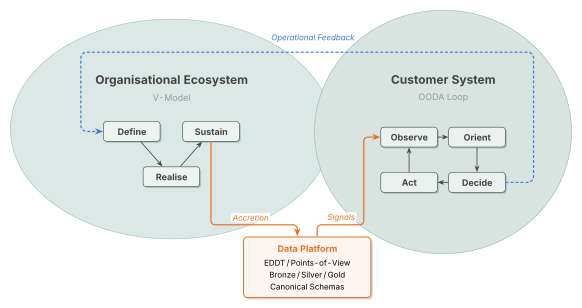

<!-- markdown-pdf:
watermark:
  text: null
-->
# EDDT Architectural Context

This document establishes the architectural context for the data analytics
ecosystem. It describes the system of interest, its operational pattern, its
data architecture, and the organisational lifecycle through which the system is
continuously evolved. It is intended to be read before the [High-Level
Needs](eddt-needs.md) and the requirements documents that trace to them.

For vocabulary definitions, see the [EDDT Glossary](eddt-glossary.md).

---

<!-- TOC generated by scripts/markdown-toc.py -->

- [1. Purpose and Scope](#1-purpose-and-scope)
- [2. System of Interest and Boundary](#2-system-of-interest-and-boundary)
  - [2.1 System of Interest](#21-system-of-interest)
  - [2.2 External Systems](#22-external-systems)
  - [2.3 Deployment Scope](#23-deployment-scope)
- [3. Operational Pattern](#3-operational-pattern)
  - [3.1 The OODA Decision Cycle](#31-the-ooda-decision-cycle)
  - [3.2 Asynchronous Observation and Eventual Consistency](#32-asynchronous-observation-and-eventual-consistency)
- [4. Data Flow Architecture](#4-data-flow-architecture)
  - [4.1 Data Tiers](#41-data-tiers)
  - [4.2 From Observation to Model](#42-from-observation-to-model)
  - [4.3 The Event-Driven Digital Twin](#43-the-event-driven-digital-twin)
  - [4.4 Points-of-View](#44-points-of-view)
  - [4.5 Points-of-View and Tier Applicability](#45-points-of-view-and-tier-applicability)
  - [4.6 Canonical Schemas and Structural Alignment](#46-canonical-schemas-and-structural-alignment)
  - [4.7 Events, Notifications, and Signals](#47-events-notifications-and-signals)
- [5. Dual Lifecycle Model](#5-dual-lifecycle-model)
  - [5.1 Two Coupled Loops](#51-two-coupled-loops)
  - [5.2 Progressive Capability Development](#52-progressive-capability-development)
  - [5.3 The Organisation as System Element](#53-the-organisation-as-system-element)
- [6. Stakeholder Perspectives](#6-stakeholder-perspectives)
- [7. Open Boundaries](#7-open-boundaries)
  - [7.1 Observe--Orient Boundary](#71-observe--orient-boundary)
  - [7.2 Act Phase Detail](#72-act-phase-detail)
  - [7.3 Deployment Topology](#73-deployment-topology)
- [8. Conclusion](#8-conclusion)

<!-- /TOC -->

## 1. Purpose and Scope

The platform exists to provide a continuous observation, modelling, and
management capability that overlays an operator's vendor-diverse, instrumented
infrastructure. It continuously observes, models, and manages the operator's
operational environment --- identifying anomalies and operational patterns of
interest, and supporting the full operational lifecycle of the deployed
elements and connected devices.

The framework is application-neutral and is applicable across domains as
varied as mining, manufacturing, healthcare, and other instrumented sectors.

Delivering this capability requires a shared data platform --- the Event-Driven
Digital Twin --- that structures observations into a coherent, queryable model
of reality. The EDDT exposes this model through formally defined Points-of-View
that serve different consumers: user-facing dashboards and APIs, real-time
signal generators, and the organisation's own research and engineering
activities.

Building and evolving both the user-facing system and the data platform
requires an organisational ecosystem --- structured engineering processes, human
roles, and lifecycle governance --- that drives the progressive development of
capabilities through iterative cycles.

These three concerns --- the user-facing system, the data platform, and the
organisational ecosystem --- are not independent layers. They form a continuous
_feedback loop_:

- Operator __operational needs__ drive what the data platform must observe and
  model.
- The data platform's representations inform what the organisation's
  __engineering processes__ can analyse and improve.
- The organisation's lifecycle iterations accrete __new capabilities__ into the
  platform, expanding what the user-facing system can detect and manage.
- Operational experience from the deployed environment feeds back into the
  __next lifecycle iteration__.

This document describes that feedback loop. It provides the architectural
context from which the system's high-level needs are derived and against which
requirements will be elicited.

---

## 2. System of Interest and Boundary

### 2.1 System of Interest

The system of interest is the entire platform: all deployments, all shared
infrastructure, and the software and data assets that comprise the framework.
It is not a single deployment instance --- it is the aggregate of all deployed
instances together with the common platform from which they are derived.

This boundary is important because capabilities developed within any single
deployment accrete into the shared platform --- source code, data models,
canonical schemas, operational knowledge, and production infrastructure ---
benefiting all subsequent deployments.

The system of interest also includes the organisational ecosystem that develops
and maintains it. The engineering processes, human roles, and lifecycle
governance described in this document are system elements (in the systems
engineering sense) --- they are part of what must be designed, managed, and
evolved.

### 2.2 External Systems

External systems are classified along three orthogonal dimensions --- whether
they share an interface with the system, whether that interface exists to
perform the system's primary purpose, and whether they support the system's
lifecycle. A single external system may satisfy any combination of these:

- **Interfacing systems** share a boundary with the system across which data,
  information, or physical contact is exchanged. In this software-platform
  context the boundary is primarily data- or information-based. Interfacing
  systems are the components of the operator's observed infrastructure ---
  instrumented devices and gateways, connected endpoint devices, management
  interfaces, and third-party service APIs exposed by upstream providers. The
  system observes and, in some cases, acts upon these systems but does not own
  or control them. Many of these interfaces and protocols are defined by
  external standards bodies, while others are vendor-proprietary or custom APIs
  exposed by the interfacing system.

- **Enabling systems** facilitate the system's lifecycle activities ---
  development, production, transition, operation-support, maintenance, or
  disposal --- but are not part of its operational environment. Examples
  include CI/CD pipelines, development tooling, test infrastructure,
  engineering collaboration systems, deployment automation and
  infrastructure-as-code, and diagnostic tooling used during maintenance.

- **Interoperating systems** interface with the system within its operational
  environment to perform a common function that supports the system's primary
  purpose. Examples include partner analytics platforms, asset management
  systems, and operations centres that jointly participate in coordinated
  detection and response workflows. While such external systems may still be
  observed through instruments, the coordination and collaboration are effected
  through governors that perform actuation and updates on these external
  systems.

### 2.3 Deployment Scope

The architecture described in this document is deployment-agnostic. The EDDT
framework, Points-of-View, tiering model, and lifecycle processes apply
regardless of whether a particular deployment is on-premises, hybrid, or
cloud-hosted. Deployment-specific constraints --- hardware selection, network
topology, instrument availability --- are resolved at the level of individual
deployment configurations and are not part of this architectural context.

---

## 3. Operational Pattern

### 3.1 The OODA Decision Cycle

The system continuously executes the Observe--Orient--Decide--Act decision cycle
across the operator's observed infrastructure. This cycle governs how the system
observes the environment, structures observations into a model of reality,
reasons about what action is warranted, and effects change.

The four phases are:

- **Observe:** The system collects data from interfacing systems via instruments
  and from its own components via telemetry. Observation is inherently
  asynchronous --- instruments may yield partial, overlapping, or stale coverage
  depending on what the interfacing system exposes and the mechanism through
  which data is collected (event-driven ingestion, synchronous polling, or
  continuous packet monitoring).

- **Orient:** Raw observations are structured into a coherent, queryable model
  through progressive data tiering and the Event-Driven Digital Twin. Given the
  asynchronous nature of observation, the model accepts eventual consistency
  across representations and tiers, and maintains traceable provenance to the
  originating data sources.

- **Decide:** The system applies analytical reasoning to the oriented model.
  This spans both automated data processing (signal generation, automated
  calibration) and human-mediated systems analysis (exploration, hypothesis
  testing, algorithm design). The Decide phase supports the continuous
  maturation of analytical capability --- from exploratory analysis through
  formalised algorithmics, calibration, and real-time signal generation.

- **Act:** The system effects change --- either through automated governors that
  push changes to interfacing systems within predefined policy boundaries, or
  through operational playbooks that guide human-mediated responses. The Act
  phase closes the loop: changes effected on interfacing systems alter what
  instruments subsequently observe.

### 3.2 Asynchronous Observation and Eventual Consistency

The asynchronous, partial nature of observation is a foundational design
principle, not a deficiency. Different instruments operate at different cadences
--- some push events in real time, others poll on configurable intervals, others
capture data streams continuously. The same entity in the observed environment
may be reported by multiple instruments at different times with different levels
of detail.

The data architecture accepts this by design. Different representations and
tiers of the same underlying data may temporarily diverge, converging over time
as asynchronous processing completes. The system does not promise strict
synchronisation across Points-of-View. Instead, it provides data provenance
metadata --- source instrument, ingestion timestamp, and data lineage --- so
that consumers can reason about the freshness, completeness, and origin of the
data they access.

---

## 4. Data Flow Architecture

### 4.1 Data Tiers

The EDDT organises data into three quality-defined tiers --- Bronze, Silver,
and Gold --- following the medallion architecture pattern. The tiers separate
concerns of durability, conformance, and business semantics; data progresses
across tiers as it is normalised, correlated, deduplicated, enriched, and
shaped for consumption.

- **Bronze** --- the raw, immutable landing zone. Bronze stores records
  exactly as received from instruments, with no schema transformation beyond
  what is necessary for transport. Malformed or incomplete records are
  preserved. Bronze records carry an **observation vocabulary** --- events
  shaped by the observing instrument's own data structures and protocol
  semantics.

- **Silver** --- the cleaned, conformed layer. Silver data has been
  validated, deduplicated, and conformed to canonical schemas hand-authored
  against a vendor-neutral domain model. Silver records carry a
  **fact vocabulary** --- canonical Snapshot and Deltaflow records that
  express what the system understands to be true about the observed
  environment.

- **Gold** --- the business-aligned consumption layer. Gold data has been
  aggregated, enriched, and structured for specific consumption patterns:
  dashboards, reports, ML feature stores, operational queries, and external
  interfaces.

Tier identity is defined by **conformance level**, not by topological
placement. A given storage system may host data at any tier; what makes a
dataset Bronze, Silver, or Gold is whether it is instrument-shaped,
canonical, or aggregated. Each tier transition adds quality guarantees and
moves the data closer to the canonical schemas that the organisation defines
and maintains.

For the formal vocabulary entries see the
[EDDT Glossary §4](eddt-glossary.md#4-data-tiering).

### 4.2 From Observation to Model

Data enters the system through instruments that connect to interfacing systems.
Each instrument is purpose-built for a particular external interface and
produces output shaped by the interfacing system's own protocols and data
structures. Event-driven instruments naturally produce deltaflow data --- a
stream of state transitions as they occur. Polling-based instruments naturally
produce snapshots --- a point-in-time view of structured elements at the
granularity the interfacing system exposes. The system must accommodate both.

Instrument output lands in the Bronze tier (§4.1). Bronze schemas are dictated
by the instrument; the primary data nature (deltaflow or snapshot) depends on
the instrument, not on an architectural choice. Where an instrument produces
snapshots, deltaflow may need to be inferred retrospectively by diffing
successive observations.

Data progresses from Bronze through Silver to Gold (§4.1). The progression is
the work of the data processing pipeline --- automated transformations that
execute without human initiation.

The runtime automation rests on design-time work that is not itself automatic.
Canonical schemas at Silver and Gold are hand-authored; the per-entity
producers that promote Bronze observations into Silver's canonical fact model
are bespoke engineering work, with shared tooling expected to be distilled
from recurring patterns over system evolution rather than specified by a
framework up front. The human roles that coordinate across this design-time
boundary are named in §6.

### 4.3 The Event-Driven Digital Twin

The digital twin is a continuously reconstructed, high-fidelity model of the
operator's observed environment. It models only observed state, not desired
state. The Event-Driven Digital Twin extends this concept by defining the
event-driven mechanisms through which the model is maintained and the formally
defined interfaces through which all consumers access it.

The EDDT is not a single data store. It is the architectural framework that
governs how data flows through the system, how it is stored at each tier, and
how it is exposed to consumers. All access to the digital twin's model of
reality is mediated through the Points-of-View --- consumers do not access
internal component state directly.

### 4.4 Points-of-View

The EDDT exposes its model through six Points-of-View, defined by the
intersection of three access patterns and two data natures.

The three access patterns serve distinct lifecycle stages:

- **Columnar** access is optimised for scan-oriented analytical workloads. It
  serves the "build" stage --- data scientists exploring historical data, ML
  engineers training models, batch reporting pipelines producing periodic
  summaries.

- **Relational** access is optimised for row-oriented operational workloads. It
  serves the "operate" stage --- user-facing dashboards, operational APIs,
  interactive investigation, and calibration interfaces.

- **Subject** access provides push-based event notification delivery via
  publish-subscribe. It serves the "react" stage --- real-time signal generators
  consuming state transitions as they occur, automated governors acting on
  detected patterns, and inter-service event propagation.

The two data natures are two views over the same underlying domain model:

- **Snapshot** (state) --- a self-contained, point-in-time representation of
  the current state of the domain model. Entities, relationships, and
  attributes as currently understood, rendered at the tier's level of
  granularity.

- **Deltaflow** (transitions) --- the history of changes that produced the
  current state. Events, mutations, insertions, and deletions that caused the
  domain model to evolve.

Snapshot and deltaflow are not alternatives to one another; they are
complementary perspectives on the same domain. Snapshot granularity matches
deltaflow granularity at the same tier.

The term "tabular" encompasses both columnar and relational access patterns
where the distinction is not material.

### 4.5 Points-of-View and Tier Applicability

Not all six Points-of-View are instantiated at every tier. The applicability
depends on the nature of the data and the quality guarantees each tier provides:

| Tier   | Columnar                                     | Relational             | Subject                                    |
|:-------|:---------------------------------------------|:-----------------------|:-------------------------------------------|
| Bronze | Snapshot or Deltaflow (instrument-dependent) | Not applicable         | Conditional (deferred until consumer need) |
| Silver | Snapshot and Deltaflow                       | Snapshot and Deltaflow | Snapshot and Deltaflow                     |
| Gold   | Snapshot and Deltaflow                       | Snapshot and Deltaflow | Snapshot and Deltaflow                     |

At Bronze, the data nature is dictated by the instrument --- event-driven
sources produce deltaflow, polling sources produce snapshots. Relational access
is not appropriate at Bronze because the data has not yet been cleaned or
conformed --- relational modelling depends on data quality and consistent
indexing. Subject namespaces at Bronze are provisioned only when a concrete
consumer need exists, to avoid unnecessary operational complexity.

At Silver and Gold, all six Points-of-View are available. Silver provides the
first tier where relational modelling is appropriate and where deltaflow can be
treated as the primary representation from which snapshot views are derived.

### 4.6 Canonical Schemas and Structural Alignment

At each tier, data structures are defined by a canonical schema --- the single,
authoritative definition of field names, types, nesting, and ordering for a
given data entity. The canonical schema is the source of truth from which all
access pattern representations are derived.

Each access pattern expresses the canonical schema as a schema projection: the
subject projection defines the notification payload layout, the columnar
projection defines the column layout and encoding, and the relational projection
defines the table and column definitions. Because all projections derive from
the same canonical schema, they are structurally aligned --- enabling zero-copy
transfer between access patterns where the underlying representations support
it.

Schema evolution is applied to the canonical schema. Projections are regenerated
from it, ensuring that changes propagate consistently across all Points-of-View.
This structural alignment is maintained by the data engineering function, which
owns the canonical schemas at Silver and Gold tiers.

### 4.7 Events, Notifications, and Signals

The data flow through the system involves three distinct levels of information:

- An **event** is the fact that a state change occurred somewhere in the
  observed environment. The system may not be able to fully observe the state
  change --- the event itself is the acknowledgement that something happened.

- A **notification** is a codified signal that represents knowledge about one or
  more events. It describes what is known about a state change --- when it
  occurred, where it occurred, what changed, and to what extent. Notifications
  are the structured communications that flow through subjects and carry
  payloads defined by the tier's canonical schema.

- A **signal** is an automated output produced by the data processing pipeline
  in response to patterns detected in Silver tier data. Signals represent the
  system's analytical conclusions and may trigger automated action (governors),
  inform human-mediated responses (operational playbooks), or inform Gold tier
  aggregations. Signal detection is scoped to Silver to preserve a clean
  separation of concerns: Silver serves as the validated, tight-latency
  substrate for internal pattern detection, while Gold is aggregated for
  external or user consumption with different lifetime and SLA envelopes.

The deltaflow data nature introduces an explicit temporal dimension: because
notifications carry timestamps and ordering, consumers can reason not only
about the current state of the observed environment but about how it evolved.
This enables time-series analysis, trend detection, and parameter drift
monitoring --- capabilities that underpin both automated calibration and
human-mediated systems analysis.

This progression --- from bare event to structured notification to analytical
signal --- mirrors the OODA loop: events occur in the observed environment
(Observe), notifications structure what is known about them (Orient), and
signals represent the system's reasoning about what to do (Decide).

---

## 5. Dual Lifecycle Model

### 5.1 Two Coupled Loops

The system evolves through two complementary mechanisms that operate at
different timescales:

The **runtime OODA loop** executes continuously in production. Instruments
observe, data processing pipelines promote data through tiers, signal generators
detect patterns, and governors or playbooks effect responses. This loop handles
automated adaptation --- calibration adjustments, signal threshold tuning, and
data processing refinements that occur without human initiation.

The **organisational V-model** governs discrete lifecycle iterations. Each
iteration traverses from Concept and Definition (left side --- defining needs,
requirements, architecture, and design), through Realisation (bottom ---
implementing system elements), to Integration and Verification (right side ---
assembling, verifying, and validating the complete capability). Completed
iterations accrete permanently into the production baseline.

These two loops are coupled:

- **Operational feedback** from the runtime loop feeds into the next V-model
  iteration. Field observations, production behaviour data, and operational
  experience are captured and fed back into the Business or Mission Analysis and
  Stakeholder Needs processes, informing what the next iteration should address.

- **Accretion** from completed V-model iterations delivers new capabilities into
  the runtime loop. Once a capability passes quality gates (verification and
  validation checkpoints), it accretes into the production baseline and becomes
  part of the continuously executing OODA loop.

### 5.2 Progressive Capability Development

The coupling between the two loops drives the continuous maturation of
analytical capability. This progression follows a characteristic pattern:

1. **Systems analysis** --- human-mediated investigation of data, across all
   tiers, through the EDDT's tabular or subject Points-of-View. Data scientists,
   systems analysts, and researchers explore patterns, test hypotheses, and
   produce findings that inform new capability requirements. This is a left-side
   V-model activity.

2. **Algorithmics** --- the codification of systems analysis findings and
   capability requirements into automated logic. Engineers and data scientists
   translate validated insights into deployable models, rules, classifiers, or
   detection algorithms. This is the bridge between human investigation and
   automated execution.

3. **Verification and validation** --- the capability is verified against its
   technical requirements and validated against the stakeholder needs it was
   designed to address. Quality gates govern whether the capability is permitted
   to accrete into the production baseline.

4. **Accretion** --- the verified capability joins the production baseline and
   begins executing as part of the runtime OODA loop. It may include new data
   processing transformations, new signal generators, new canonical schemas, or
   new governor policies.

5. **Automated calibration** --- once deployed, the capability's parameters are
   continuously tuned against production data by the data processing pipeline.
   When calibration drift is detected through operational health monitoring,
   engineer-mediated calibration may be triggered, initiating a new systems
   analysis activity and potentially a new lifecycle iteration.

This pattern is not a one-time pipeline. It repeats with each lifecycle
iteration, and multiple iterations may be in progress simultaneously at
different stages. When an iteration stalls for lack of empirical data, it may
spawn a subordinate recursive iteration to build the enabling infrastructure ---
the subordinate system remains in production permanently, becoming part of the
accreted baseline.

### 5.3 The Organisation as System Element

The organisational ecosystem --- its people, processes, and tooling --- is a
first-class part of the system of interest. The data scientists who explore, the
engineers who formalise, the architects who govern trade-offs, the verification
engineers who define quality gates, and the field operations personnel who feed
back operational experience are all system elements whose roles must be designed
and managed.

The EDDT's Points-of-View serve both the user-facing system and the
organisation's own engineering activities. The same Silver and Gold tier data
that powers user dashboards also supports the systems analysis that
discovers new detection capabilities. The same canonical schemas that define
notification payloads for real-time signal generation also define the columnar
layouts that data scientists query for historical exploration. This dual-use of
the data platform is a deliberate architectural choice --- it ensures that the
organisation's engineering processes operate on the same data reality that the
user-facing system manages.

---

## 6. Stakeholder Perspectives

The architectural framework serves different stakeholder groups in different
ways. The following table summarises how the primary stakeholder categories
relate to the OODA phases, the data tiers, and the feedback loop between the
user-facing system, the data platform, and the organisational ecosystem.

| Stakeholder Category      | Primary OODA Phases          | Tier Focus                    | Feedback Loop Role                                        |
|:--------------------------|:-----------------------------|:------------------------------|:----------------------------------------------------------|
| Business & Strategy       | Pre-loop (strategic context) | Gold (reporting)              | Define why the system exists; govern lifecycle investment |
| Engineering & Development | All (design and build)       | All tiers                     | Advance capabilities through V-model iterations           |
| Operations & Support      | Observe, Orient, Decide, Act | All tiers (health monitoring) | Run the runtime loop; feed back operational experience    |
| Consumer Personas         | Orient, Decide               | Silver and Gold               | Consume the system's outputs; define operational needs    |
| External Ecosystem        | Observe (instrument sources) | Bronze (payload schemas)      | Define what the system can observe and act upon           |

---

## 7. Open Boundaries

The following areas are acknowledged as boundaries of this context document.
They represent concerns that require further analysis or requirements
elicitation before the architectural context is complete.

### 7.1 Observe--Orient Boundary

The precise contract between instruments and the data processing pipeline ---
what an instrument produces as its output, in what format, and through what
mechanism --- is not defined in this document. Instruments are known to vary
significantly: some produce event-driven notifications, others produce periodic
snapshots, and the protocols range from binary event streams to REST APIs to
CLI-over-SSH sessions. The detailed boundary contract will be established during
requirements elicitation for the functional architecture.

The downstream side of the same Observe--Orient boundary --- the translation
of Bronze observations into Silver's canonical fact-model representation ---
is addressed by per-producer modules under a decoupled tier contract; the open
scope of this section narrows to the instrument-to-Bronze contract.

### 7.2 Act Phase Detail

The Act phase (governors and operational playbooks) is described conceptually in
this document as the mechanism that closes the OODA loop. The detailed
requirements for how signals flow to governors, what policy boundaries constrain
automated action, and how playbook procedures are defined and managed are
pending requirements elicitation for actuation and response.

### 7.3 Deployment Topology

This document describes the architecture deployment-agnostically. How the EDDT
framework, Points-of-View, and tiering model map to specific deployment
topologies (on-premises, hybrid, cloud) --- and whether deployment constraints
affect instrument availability or POV instantiation --- is resolved at the level
of individual deployment configurations.

---

## 8. Conclusion

The framework described here is not a finished system. It is an architectural
starting point --- a shared language, a set of structural commitments, and a
feedback loop through which the system will grow.

The data platform does not yet model every entity in every operator's
environment. The organisational lifecycle has not yet completed every iteration
it will need. The instruments, schemas, algorithms, and signals that will
ultimately define the platform's value are, in many cases, yet to be built. That
is by design. The architecture assumes incompleteness and provides the
mechanisms --- accretion, recursive iteration, operational feedback --- through
which incompleteness is progressively resolved.

What this document establishes is the ground on which that work proceeds: the
observation is asynchronous and partial, the model is eventually consistent, the
data flows through tiers of increasing quality, and six Points-of-View ensure
that every consumer --- whether a real-time signal generator, a data scientist
with a hypothesis, or an operator investigating an anomaly --- can access the
model in the way their work demands.

The next step is yours. The [High-Level Needs](eddt-needs.md) derived from
this context define what the system must achieve. The requirements that will
trace to those needs will be shaped by the people, teams, and partners who
understand the operational realities that no architectural document can fully
anticipate. This framework exists to support that journey.
