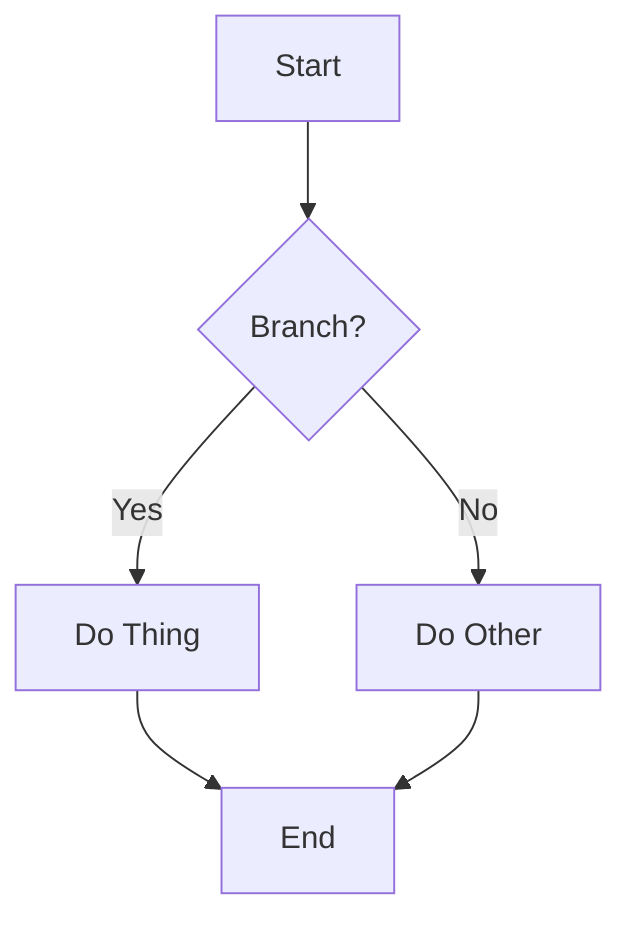

# markdown-pdf.py

Generate a styled PDF from a markdown document. The script converts
markdown to HTML (with Pygments-highlighted code, a generated TOC,
LaTeX math rendered server-side to MathML, and Mermaid fenced-block
diagrams pre-rendered to PNG) and then renders that HTML to A4 PDF via
WeasyPrint.

The script itself carries no branding. Colours and brand text live in an
optional theme file; the accompanying logo lives in a sibling assets
directory. Both are auto-discovered — drop the files in place for the
branded look, omit them for a neutral monochrome result.

## Usage

```
./scripts/markdown-pdf.py INPUT.md [options]
```

### Options

| Flag              | Default                                     | Purpose                                                                          |
|:------------------|:--------------------------------------------|:---------------------------------------------------------------------------------|
| `-o`, `--output`  | `INPUT.pdf`                                 | Output PDF path.                                                                 |
| `--logo PATH`     | `<script>/../assets/logo.svg` (if present)  | Footer + title-page logo. Explicit path is resolved against cwd.                 |
| `--theme PATH`    | `<script>/../assets/theme.{yaml,yml,json}`  | Palette + brand text overrides. Explicit missing path is an error.               |
| `--no-justify`    | off                                         | Use left-aligned text instead of full justification.                             |
| `--style NAME`    | `tango`                                     | Pygments style for fenced code blocks. `pygmentize -L styles` lists options.     |
| `--no-math`       | off                                         | Skip `$...$` / `$$...$$` parsing and MathML conversion.                          |
| `--no-mermaid`    | off                                         | Skip ```` ```mermaid ```` rendering; the source falls through as a plain fenced code block. |

### Dependencies

Required for every invocation:

- `markdown`
- `jinja2`
- `weasyprint`
- `pygments`
- `pymdown-extensions`
- `latex2mathml`

Additionally, `PyYAML` is required only when the selected theme file has
a `.yaml` or `.yml` extension. It is imported lazily, so JSON-only or
default-palette runs work without it.

**External binary for diagrams:** `mmdc` (Mermaid CLI) is required at
build time when a source document contains ```` ```mermaid ```` fenced
blocks. Install it via:

```
npm install -g @mermaid-js/mermaid-cli
```

If `mmdc` is not on `PATH` and `--no-mermaid` is not set, the build
fails with an actionable error. Pass `--no-mermaid` to render mermaid
fences as plain syntax-highlighted code blocks (useful when working
offline or on a machine without `node`/`npm`).

## Assets directory layout

The script resolves its defaults from `<script>/../assets/`:

```
docs/
  assets/
    logo.svg      # auto-picked as the footer + title-page logo
    theme.yaml    # auto-picked as the palette override
  scripts/
    markdown-pdf.py
    markdown-pdf.md
```

Any of these files may be missing. The explicit `--logo` / `--theme`
flags always win over auto-discovery.

## Theme file schema

A theme is a YAML or JSON mapping with three top-level keys —
`colours`, `headings`, and `brand`. Every key is optional; missing
keys fall back to the built-in defaults declared in `BUILTIN_THEME`
and `BUILTIN_HEADINGS` (inside the script).

**British spelling is canonical.** `colours:` and `colour:` are the
preferred forms; American spellings (`colors:`, `color:`) are
accepted and normalised to British canonical at load time, so
existing themes continue to work unchanged.

```yaml
colours:
  accent:             "#e57222"  # h2 underline, h3, links, blockquote edge, brand prefix
  heading:            "#434343"  # h1, h2, h4 default text; thead background; brand suffix
  body:               "#333333"  # body text
  muted:              "#555555"  # toc subheadings, blockquote text
  subtle:             "#999999"  # page footer, date, subtitle
  faint:              "#bbbbbb"  # commit sha
  border:             "#e0e0e0"  # hr, table cell borders
  code_bg:            "#f4f4f4"  # inline code + pre block background
  row_alt:            "#f8f8f8"  # table row zebra stripe
  # Status-pill palette. The traffic-light triplet is canonical;
  # status_resolved / status_choice / status_investigate are accepted
  # as legacy aliases (propagated onto status_green / status_amber /
  # status_red at load time).
  status_green:       "#2e7d32"  # CSS: .status-green, .status-resolved
  status_amber:       "#ef6c00"  # CSS: .status-amber, .status-choice
  status_red:         "#c62828"  # CSS: .status-red, .status-investigate
  status_black:       "#212121"  # dark neutral (not pure black)
  status_grey:        "#616161"  # midtone neutral
  status_blue:        "#1565c0"
  status_purple:      "#6a1b9a"
  status_teal:        "#00695c"

headings:
  # Per-level overrides. Each level inherits BUILTIN_HEADINGS
  # defaults; only the keys set here override. Permitted keys per
  # level: colour, size, weight, style, margin_bottom, padding_bottom,
  # border_bottom { width, colour }, page_break_after.
  # `colour` may name a palette key (resolved) or be a hex literal.
  h4:
    colour: accent     # palette key → resolved to colours.accent (#e57222)
    style:  italic     # additional distinguisher from bold body text

brand:
  name:     "OneLayer"      # omit for no brand block on the title page
  subtitle: "Architecture"  # omit for no subtitle line
  split:                    # two-tone rendering of `name` (optional)
    prefix:        "One"    # first half of the name
    suffix:        "Layer"  # second half of the name
    prefix_colour: null     # optional override; defaults to colours.accent
    suffix_colour: null     # optional override; defaults to colours.heading
```

### Rendering rules

- `brand.name` omitted (or `null`): no brand block on the title page,
  and the running footer reduces to just the document title.
- `brand.subtitle` omitted: the sub-line under the brand name is
  skipped; the footer is `"{name} — {title}"` instead of
  `"{name} {subtitle} — {title}"`.
- `brand.split` set with both `prefix` and `suffix`: the brand name is
  rendered in two tones. Colours come from `split.prefix_colour` and
  `split.suffix_colour`; either may be omitted or `null`, in which case
  they fall back to `colours.accent` and `colours.heading` respectively.
  Without a split, the whole name is a single line in the heading colour.
- `headings:` may add or override per-level styling. Levels h5 and h6
  are not styled by the built-in defaults; user themes may add
  records for them following the same schema.
- Unknown palette keys are ignored. The script never errors on extra
  keys — it simply does not reference them.

### JSON equivalent

The same theme expressed as JSON:

```json
{
  "colours": {
    "accent":  "#e57222",
    "heading": "#434343"
  },
  "headings": {
    "h4": { "colour": "accent", "style": "italic" }
  },
  "brand": {
    "name":     "OneLayer",
    "subtitle": "Architecture",
    "split":    { "prefix": "One", "suffix": "Layer" }
  }
}
```

Pass either format via `--theme`, or place it in the default assets
directory. When multiple default candidates exist, the first match wins
in the order `theme.yaml`, `theme.yml`, `theme.json`.

## Page watermark

A configurable per-page watermark — typically the word `DRAFT` —
can be enabled via the theme YAML or the `--watermark` CLI flag.
The watermark renders centred, rotated, semi-transparent, and on
the page background (behind document content), so the body text
stays readable and the PDF text layer is unaffected (copy-paste
returns the document text alone).

Default: **off**. The watermark is opt-in.

### CLI

```
./docs/scripts/markdown-pdf.py docs/my-report.md --watermark "DRAFT"
```

`--watermark TEXT` enables the watermark with the supplied text,
overriding any theme-level setting. `--no-watermark` forces off,
overriding both the CLI default and any theme value.

### Theme YAML

Supply a `watermark:` block to enable the watermark by default for
this theme. A `text:` value of `null` (or omitting the block
entirely) keeps the watermark off.

```yaml
watermark:
  text:    "DRAFT"        # null/absent ⇒ disabled
  colour:  status_red     # palette key or hex literal
  opacity: 0.15           # 0.0–1.0
  size:    "120pt"        # CSS font-size
  angle:   -30            # degrees of rotation
  weight:  700            # CSS font-weight
```

Defaults when only `text` is set:

| Key       | Default      |
|:----------|:-------------|
| `colour`  | `status_red` |
| `opacity` | `0.15`       |
| `size`    | `"120pt"`    |
| `angle`   | `-30`        |
| `weight`  | `700`        |

### Doc-level directive

A markdown source file can carry its own watermark configuration via
a single `<!-- markdown-pdf: ... -->` HTML comment placed in the
document preamble (above the first `## Heading`). The comment is
invisible on every Markdown renderer (GitHub, Antigravity preview,
plain editors) yet machine-readable by `markdown-pdf.py`.

```markdown
<!-- markdown-pdf:
watermark:
  text: "DRAFT"
  colour: "status_amber"
-->
# Document Title

## First section
…
```

**Precedence.** The doc-level directive sits between the theme and
the CLI in the watermark-resolution chain:

| Layer            | Source                                | Wins when…                                            |
|:-----------------|:--------------------------------------|:------------------------------------------------------|
| Built-in default | `BUILTIN_THEME` (`text: null`)        | Nothing else specified                                |
| Theme            | `theme.yaml` `watermark:` block       | Theme provides a value and no doc / CLI override does |
| Doc directive    | `<!-- markdown-pdf: ... -->` block    | Author wants a per-document default                   |
| CLI              | `--watermark TEXT` / `--no-watermark` | Explicit final-word from the invoker (CI, reviewer)   |

The directive **deep-merges** over the theme: setting `watermark.text`
in the directive overrides the theme's text but inherits the theme's
`colour`, `opacity`, `size`, `angle`, and `weight`. To disable the
watermark for a single document while the theme still defines one,
write `watermark: { text: null }`.

**Position.** The directive must appear above the first `## Heading`.
A comment of the same form below the first H2 is an authoring mistake
and the build fails with a clear error.

**Schema.** V1 acts on the `watermark:` top-level key only. Other
top-level keys are tolerated (forward-compat) but produce a `warning:`
on stderr — useful both as a typo check and as a forward-compatibility
door for additional doc-level directives later.

**Errors.** Malformed YAML inside the directive, more than one
directive in the preamble, and a directive below the first H2 each
produce a build failure with a source-line citation. Silent fallback
would defeat the point of an explicit override.

### How it works

When the watermark is enabled, the script generates an inline SVG
carrying the rotated, fill-opacity-bounded text and embeds it as a
data URI on a CSS `@page { background-image: url(...) }` rule.
WeasyPrint renders the SVG on every page background, scaled to
match the page dimensions. No external assets, no per-page CSS
hackery; the rendering is identical on every page.

## Examples

Generate a PDF using auto-discovered logo and theme:

```
./docs/scripts/markdown-pdf.py docs/my-report.md
```

Generate a brand-neutral PDF (ignore the auto-discovered theme by
pointing at an empty override):

```
echo '{}' > /tmp/blank.json
./docs/scripts/markdown-pdf.py docs/my-report.md --theme /tmp/blank.json
```

Override only the accent colour without touching branding:

```yaml
# docs/assets/theme.yaml
colours:
  accent: "#0066cc"
```

Render with a `DRAFT` watermark for a review build:

```
./docs/scripts/markdown-pdf.py docs/my-report.md --watermark "DRAFT"
```

Force the watermark off, overriding any theme value:

```
./docs/scripts/markdown-pdf.py docs/my-report.md --no-watermark
```

## Mermaid diagrams

Any ```` ```mermaid ```` fenced block in the markdown source is
rendered to an image at build time and embedded in the PDF. The
rendering is enabled by default; pass `--no-mermaid` to fall through
to plain code rendering.

### How it works

`render_mermaid` is invoked on the full markdown source *before*
Python-Markdown runs. It scans for ```` ```mermaid ```` blocks, shells
out to `mmdc` for each, caches the resulting PNG in
`<script-dir>/.mermaid-cache/`, and rewrites the block to a
`<div class="mermaid-diagram"></div>`
wrapper. Python-Markdown's `extra` extension passes the wrapper
through as a raw HTML block; WeasyPrint renders the inline data URI
natively.

The cache is keyed by a 16-character SHA-256 prefix of the block's
source, so repeat builds skip unchanged diagrams. Clear the cache
with `make mermaid-clean` (from `docs/Makefile`) or by removing the
directory manually.

### Why PNG and not SVG

Mermaid 11's default flowchart renderer emits node labels inside SVG
`<foreignObject>` elements (HTML-in-SVG labels). WeasyPrint does not
implement `<foreignObject>`, so SVG output leaves node text invisible
in the PDF. The `flowchart.htmlLabels: false` config flag that used
to force plain SVG `<text>` labels was removed from the default
renderer in Mermaid 11.

PNG output at 3× scale (`--scale 3` in the `mmdc` invocation) bakes
labels into the raster at high enough fidelity to look clean in A4
print. The loss of vector scalability is acceptable in exchange for
reliable text rendering; each diagram adds roughly 10–50 kB to the
PDF as a base64-encoded PNG.

> **Future alternative — vector round-trip via `pdf2svg`.** A
> pure-vector path is possible without touching WeasyPrint's
> (absent) `<foreignObject>` support: `mmdc -e pdf` produces a
> real vector PDF, and tools like `pdf2svg`, `mutool convert`, or
> `dvisvgm --pdf` flatten that PDF to plain SVG with real `<text>`
> elements (no `<foreignObject>`). That mirrors the TikZ pipeline
> already used by `docs/diagrams/Makefile` (xelatex → PDF →
> dvisvgm). Not adopted in v1 because it adds a system dependency
> and doubles the per-diagram subprocess cost; PNG fidelity is
> adequate for current needs. Revisit if vector scaling or print
> fidelity becomes important.

### Theming

A small JSON config lives next to the script at
`scripts/mermaid-config.json`. It picks the `neutral` Mermaid theme
and a sans-serif font family so diagrams blend with the report
styling. Diagram colours are currently Mermaid's defaults; aligning
them with the document's `theme.colours` palette would require
per-entity overrides in the config and is a follow-on refinement.

### Snap-confined `mmdc` warning

If `mmdc` is installed via Snap (`/snap/bin/mmdc`), the binary is
sandboxed out of `/tmp` and other non-home directories. The cache
location (`<script>/.mermaid-cache/`) is inside the user home tree
and works fine; custom cache locations should stay under `$HOME`.
The script surfaces a clear hint in the error message when this is
the cause of a build failure.

### Authoring

Write the diagram inline:

````markdown

````

All Mermaid 11 diagram types are supported (flowchart, sequence,
class, state, ER, gantt, git-graph, pie, mindmap, timeline, sankey).
The test showcase at `designs/scripts/tests/mermaid-showcase.md`
exercises one example of each type; build it with `make test-mermaid`
from `designs/scripts/tests/`.

## Size-variant code fences

Individual fenced code blocks can be rendered at a smaller or larger
font size than the default. This is intended for content that is long
by design (NATS subject strings, multi-dotted domain paths, structured
sample data) and would otherwise overflow the default code-block
width, or — occasionally — for call-out blocks that warrant emphasis.

Three variants are provided:

| Variant      | Font size | Typical use                                  |
|:-------------|:----------|:---------------------------------------------|
| `small-text` | 7pt       | Long single-line samples (default is 8pt)    |
| `tiny-text`  | 6pt       | Dense content where density beats legibility |
| `large-text` | 10pt      | Emphasised call-out block                    |

Two equivalent fence forms are supported. Pick whichever reads best
for the specific block:

### Form 1 — attribute list on a language fence

Preferred when syntax highlighting is desired. Composes with any
language tag — pygments highlights as usual, and the size variant is
applied to the wrapping `<div>`.

````markdown
```python {: .small-text }
subject = "ol.data.delta.acme.ue-materialiser-1.silver.3gpp.lte…"
```
````

### Form 2 — bare fence tag

Convenient for plain-text blocks (no highlighting, no language noise
in the fence). Used when the block contains literal sample data or
long strings where highlighting would be counter-productive.

````markdown
```small-text
ol.data.delta.acme.ue-materialiser-1.silver.3gpp.lte.ue-session.imsi.310150123456789
```
````

### How it works

The two forms are implemented through
[`pymdownx.superfences`](https://facelessuser.github.io/pymdown-extensions/extensions/superfences/):

- Form 1 uses the extension's attribute-list support; pygments
  highlighting is applied via `pymdownx.highlight` (configured with
  `css_class = "codehilite"` to match the existing pygments
  stylesheet scope), and the variant class is attached to the
  wrapping `<div class="<variant> codehilite">`.
- Form 2 uses `custom_fences` registered in `md_to_html()` to map
  each bare tag to a non-highlighted `<pre class="<variant>">` block.

CSS selectors in `markdown-pdf.py` catch both attachment points. Unit
tests in `designs/scripts/tests/test_markdown_pdf.py` verify the
shape of each form.

## Implementation notes

- The HTML template is a single `HTML_TEMPLATE` constant rendered with
  Jinja2. Colour literals are substituted directly into the CSS; CSS
  curly braces do not conflict with Jinja delimiters (`{{ … }}`).
- `render_math` converts `$…$` and `$$…$$` blocks to MathML via
  `latex2mathml` after arithmatex extraction. See the in-file
  "GitHub-compatibility note" for authoring guidance. Math in
  headings is rendered in both the body and the auto-generated table
  of contents — the TOC pass (`render_math_in_toc`) catches the bare
  `\(…\)` form left behind when Python-Markdown's TOC extractor strips
  the arithmatex wrapper span. The underlying anchor slug is generated
  from heading text after stripping math markup, so navigation
  continues to work.
- `render_mermaid` converts ```` ```mermaid ```` blocks to inlined
  PNG data URIs via `mmdc`; see the "Mermaid diagrams" section
  above.
- The title `#` heading is stripped from the markdown body before
  rendering — it is re-emitted on the title page. A TOC block written
  by `markdown-toc.py` (recognised by its comment markers) is also
  stripped.
- The source is split into preamble (everything between the title and
  the first `## ` heading) and body, then converted in two
  Python-Markdown passes. To make `[text][ref]` reference-style links
  in the abstract / preamble resolve against `[ref]: url` definitions
  that typically live at the bottom of the document, the body is
  converted **first**; its `Markdown.references` dict is then injected
  into the preamble's converter via the `references=` argument of
  `md_to_html` before the preamble's `convert()` call. The
  preprocessor merges any preamble-local definitions on top, so
  preamble-only refs continue to work and label collisions resolve to
  the preamble-local value (matching the spec's last-definition-wins
  rule). Inline links `[text](url)` need no resolution and are
  unaffected by the order or the handover.
- A short git SHA is embedded in the bottom-right footer when the input
  lives inside a git working tree.
