# Mermaid Showcase

This self-test document exercises the Mermaid-fence support added to
`markdown-pdf.py`. Each section below embeds one diagram of a
different Mermaid type. Building this document to PDF verifies that:

1. Every supported diagram type renders as an SVG (not as a
   syntax-highlighted code listing).
2. Diagrams sit in their original position in the document flow.
3. The cache mechanism avoids re-rendering unchanged diagrams on
   repeat builds.
4. Mixing Mermaid blocks with prose, code blocks, and math does
   not confuse the pre-processor.

Build with:

```
make test-mermaid
```

from this `designs/scripts/tests/` directory, or directly via:

```
./designs/scripts/markdown-pdf.py designs/scripts/tests/mermaid-showcase.md
```

A plain code block (not Mermaid) should still render as syntax-
highlighted source:

```python
def hello():
    print("not a diagram — just a control")
```

An inline math check (also not Mermaid): $\mathcal{A}(s, d) = s'$.

---

## 1. Flowchart

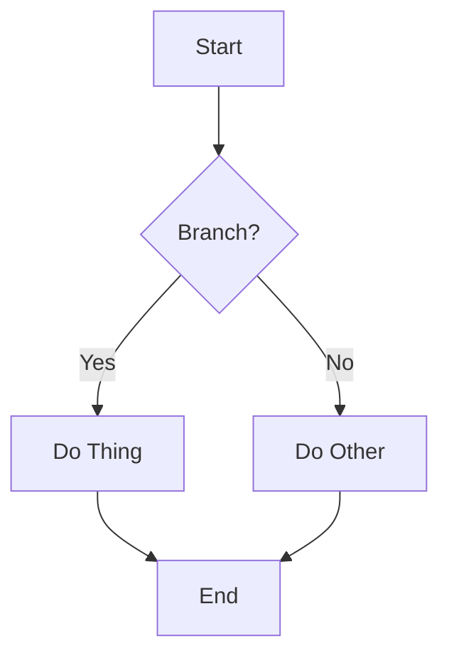

## 2. Sequence Diagram

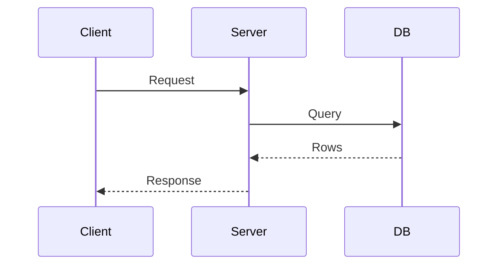

## 3. Class Diagram

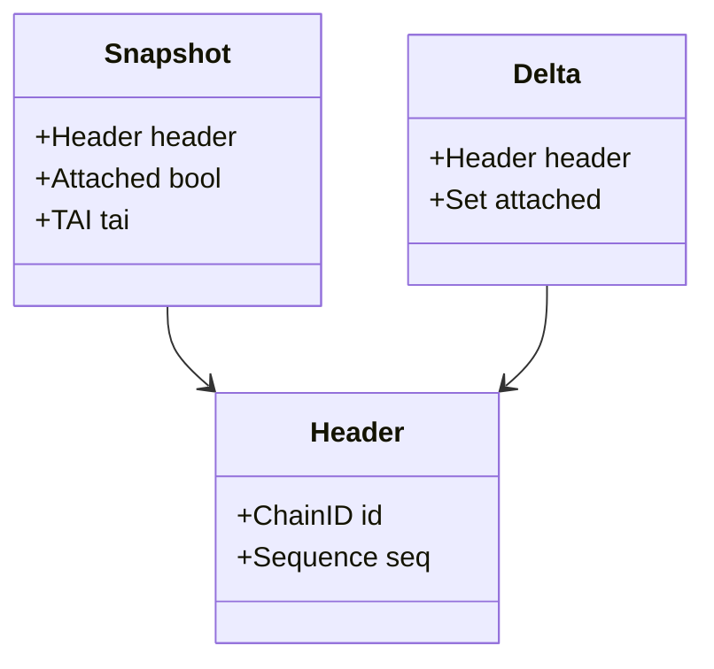

## 4. State Diagram

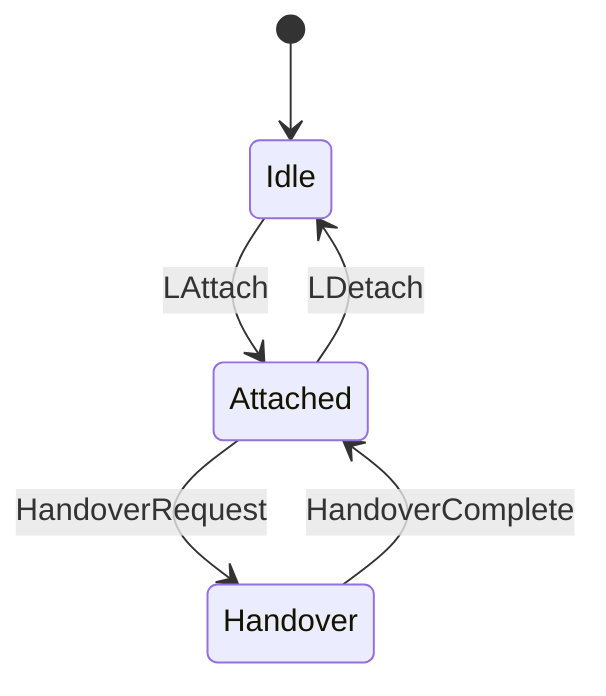

## 5. Entity-Relationship Diagram

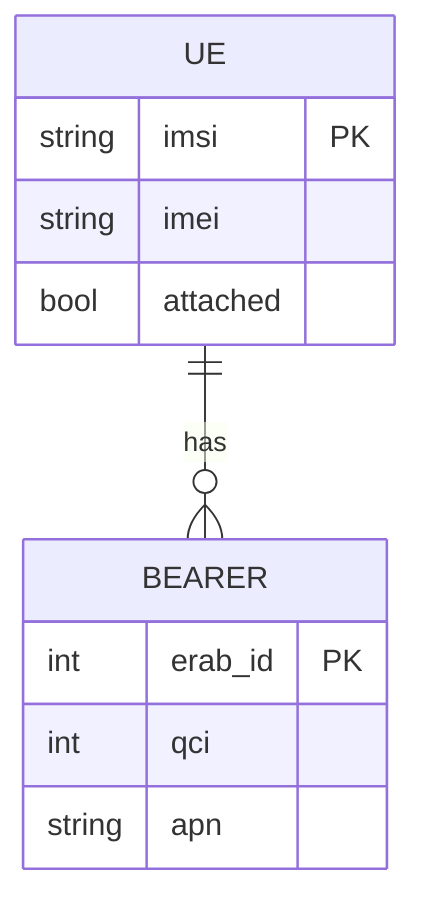

## 6. Gantt Chart

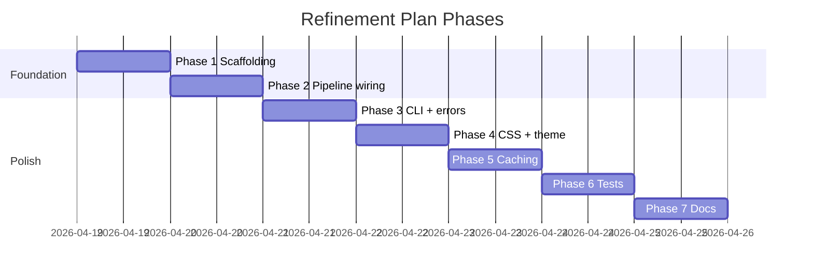

## 7. Git Graph

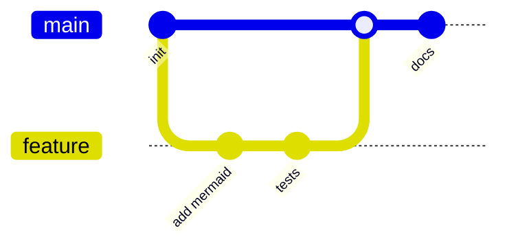

## 8. Pie Chart

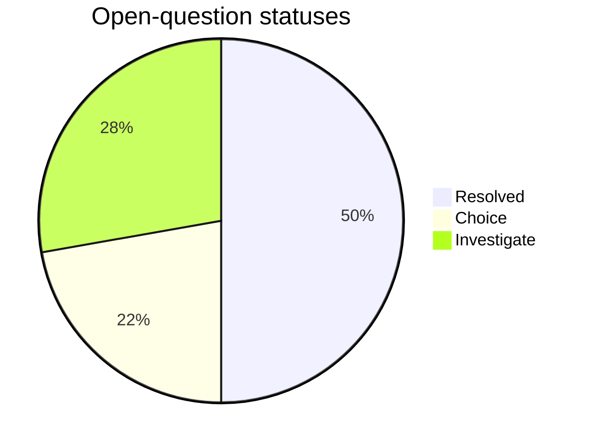

## 9. Mindmap

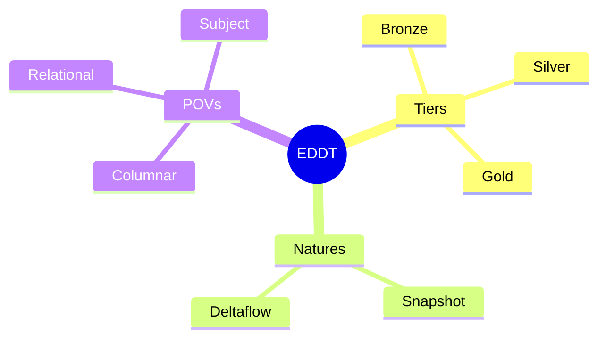

## 10. Timeline

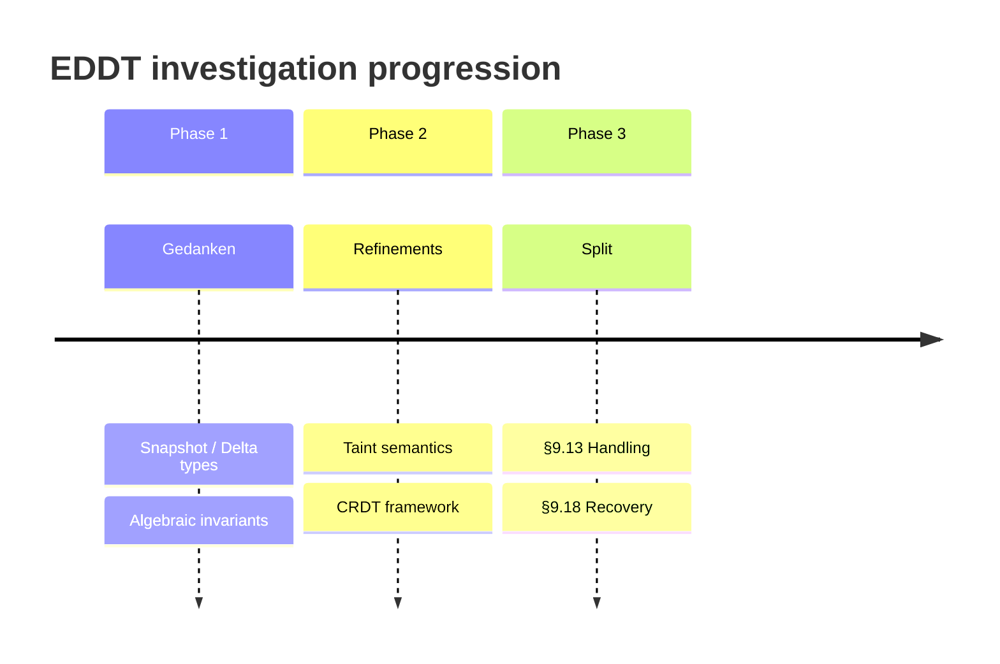

## 11. Sankey Diagram

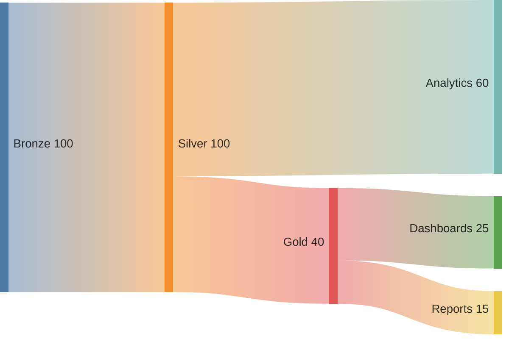

---

## Closing

All eleven diagrams above should render as images in the PDF. If
any appear as syntax-highlighted code, the pre-processor is not
intercepting the fence correctly; if any fail to render, `mmdc`
returned a non-zero exit code (check stderr during build).

The `--no-mermaid` flag can be used to force fall-through to plain
code rendering, for offline work or when `mmdc` is unavailable.
